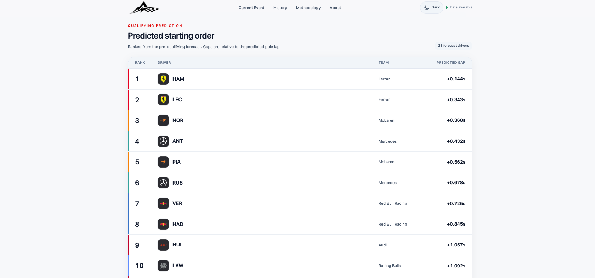

<p align="center">
  
</p>

<p align="center">
  <strong>Production-deployed machine-learning system for Formula 1 qualifying prediction.</strong><br>
  Checkpoint-safe forecasting from free-practice data, with chronological validation, prospective monitoring and automated live operations.
</p>

<p align="center">
  <a href="https://apex-pulse-ten.vercel.app"><strong>Live Demo</strong></a>
  ·
  <a href="#results">Results</a>
  ·
  <a href="#architecture">Architecture</a>
  ·
  <a href="#quick-start">Quick Start</a>
</p>

<p align="center">
  
  
  
  
  
  
  
</p>

---

## Overview

**Apex Pulse** predicts Formula 1 qualifying performance using only information that would have been available when the forecast was issued.

Predictions are supported after **FP1, FP2 and FP3**. The primary target is each driver's **qualifying gap to pole in seconds**, from which the predicted qualifying order is derived.

The project extends beyond offline model training: it includes guarded data ingestion, chronological backtesting, policy governance, prospective replay, immutable forecast and settlement records, an autonomous race-weekend orchestrator, a read-only API and a deployed public frontend.

|                       |                                                                |
| --------------------- | -------------------------------------------------------------- |
| Historical scope      | **2023–2025**                                                  |
| Conventional weekends | **44**                                                         |
| Modeling rows         | **2,634**                                                      |
| Dataset columns       | **182**                                                        |
| Drivers / teams       | **28 / 11**                                                    |
| Walk-forward folds    | **39 / 39**                                                    |
| Data source           | **FastF1**                                                     |
| Public app            | [apex-pulse-ten.vercel.app](https://apex-pulse-ten.vercel.app) |

<p align="center">
  
</p>

---

## Architecture

```mermaid
flowchart LR
    A[FastF1 sessions] --> B[Lap cleaning & validation]
    B --> C[Checkpoint-safe features]
    C --> D[Historical modeling dataset]
    D --> E[Walk-forward evaluation]
    E --> F[Champion policy & governance]
    F --> G[Prospective monitoring]

    G --> H[Pre-Q forecast]
    H --> I[Immutable snapshot]
    I --> J[Post-Q validation]
    J --> K[Settlement & integrity checks]
    K --> L[Dashboard artifacts]

    L --> M[FastAPI · Railway]
    M --> N[Next.js · Vercel]

    O[5-minute scheduler] --> P[Weekend orchestrator]
    P --> G
```



The public API is intentionally **read-only**. Forecasting and settlement mutations remain behind the same guarded backend workflows used by the autonomous scheduler.

---

## Technical highlights

### Leakage-safe forecasting

The central data contract is simple:

> **A feature may encode only information available when the prediction would have been issued.**

This is enforced through:

* checkpoint-specific FP1 / FP2 / FP3 feature provenance;
* qualifying outcomes excluded from predictors;
* historical features built only from earlier events;
* complete-event train/test separation;
* chronological walk-forward backtesting;
* prior-fold-only model selection and uncertainty calibration.

An `after_fp2` prediction can therefore use FP1 and FP2, but never FP3 or qualifying information.

### F1-specific feature engineering

Raw fastest laps are noisy proxies for qualifying pace because practice programmes differ in fuel load, tyres, traffic, setup work and run intent.

Apex Pulse combines:

| Feature family       | Examples                                                  |
| -------------------- | --------------------------------------------------------- |
| **Practice pace**    | best/median lap, push-lap pace, theoretical best, sectors |
| **Relative pace**    | gap/rank to session best                                  |
| **Teammate context** | driver-to-teammate pace deltas                            |
| **Team context**     | team-best pace and within-team comparisons                |
| **Tyre context**     | compound, tyre life and stint information                 |
| **Historical form**  | prior driver/team qualifying performance                  |
| **Data quality**     | missingness, lap counts and extreme-signal flags          |

Push-like laps are identified with deterministic validity and pace rules rather than assuming every timed lap represents qualifying intent.

### Model and policy governance

The evaluation framework includes:

* robust practice baselines;
* Ridge Regression;
* Random Forest;
* HistGradientBoostingRegressor;
* feature-group ablations;
* temporal weighting;
* static and nested champion policies;
* guarded policy switching;
* conformal uncertainty estimates.

Model selection is checkpoint-specific because the information regime changes substantially between FP1 and FP3.

Most importantly, **the model with the strongest retrospective aggregate metric is not automatically promoted to production**.

### Prospective evaluation

Historical walk-forward backtesting is complemented by frozen-policy and retrain-based prospective replay.

For each held-out event, the system can reconstruct the legal training history available before that event, generate predictions, preserve diagnostic shadow candidates separately and reveal qualifying outcomes only at settlement time.

This separates retrospective model discovery from deployment-policy evidence.

---

## Results

FP3 is the strongest ML checkpoint: by then practice contains substantially more representative qualifying signal than FP1 or FP2.

### Season-aware FP3 experiment

A fixed comparison evaluated the same Random Forest with `base_plus_relative` features under two training policies on identical rows:

| Training policy               |      FP3 MAE | Scope                            |
| ----------------------------- | -----------: | -------------------------------- |
| Uniform historical training   |  **0.920 s** | 774 rows · 39 folds              |
| Current-season-aware training |  **0.729 s** | 774 rows · 39 folds              |
| Difference                    | **−0.191 s** | retrospective aligned comparison |

The gain is regime-dependent. Current-season weighting is most useful after enough races from the active season have accumulated; cold-start events show little benefit.

### Why the best retrospective candidate is not automatically deployed

Frozen season-held-out evaluation produced mixed evidence:

| Split                       | Static FP3 MAE | Season-aware FP3 MAE |
| --------------------------- | -------------: | -------------------: |
| Train 2023 → Test 2024      |    **0.946 s** |              0.951 s |
| Train 2023–2024 → Test 2025 |        0.788 s |          **0.528 s** |

A stricter event-by-event retrain replay was more conservative and did not provide sufficient evidence to replace the default production policy.

**Production decision:** retain the stable policy while continuing prospective evaluation.

This distinction between *best historical candidate* and *deployed policy* is deliberate.

---

## Production workflow

Apex Pulse runs as a single-writer production system.

### Automated race-weekend lifecycle

Every **5 minutes**, the scheduler invokes a deterministic one-shot weekend orchestrator.

It:

1. identifies the current/next Formula 1 event;
2. distinguishes scheduled session completion from actual public-data availability;
3. waits for the required practice evidence;
4. invokes the guarded pre-qualifying workflow;
5. preserves the forecast as an immutable snapshot;
6. waits for qualifying data;
7. validates targets and driver-set parity;
8. settles the forecast;
9. refreshes validated dashboard artifacts.

Repeated ticks are idempotent. Existing forecasts and settlements are reused rather than regenerated.

Sprint/non-standard weekends are currently treated as unsupported safe no-ops rather than being remapped onto incompatible FP sessions.

### Integrity guarantees

Historical monitored events are protected with event-scoped semantic fingerprints covering forecast, settlement, registry, entry-list, feature/target and dashboard evidence.

Legitimate new events may be appended. Mutation or deletion of previously recorded events is treated as a blocking integrity failure.

A 14-step network-independent rehearsal tests the full state-machine lifecycle without mutating production records.

### Deployment

**Backend**

* FastAPI
* Docker
* Railway
* persistent runtime volume
* 5-minute scheduler
* read-only public API

**Frontend**

* Next.js
* React / TypeScript
* Tailwind CSS
* Vercel
* automatic server-data refresh
* responsive dark/light interface

The browser never downloads FastF1 data, trains models or creates forecasts.

---

## Quick start

### Install

```bash
git clone https://github.com/matteosgobba/apex-pulse.git
cd apex-pulse

python3 -m venv .venv
source .venv/bin/activate
python -m pip install -e ".[dev]"
```

Inspect available commands:

```bash
python -m f1_prediction.cli --help
```

### Build the historical dataset

```bash
python -m f1_prediction.cli build-season-dataset \
  --seasons 2023 2024 2025 \
  --preset conventional
```

Generated data and model artifacts are intentionally excluded from Git.

### Run a chronological evaluation

```bash
python -m f1_prediction.cli dataset-report
python -m f1_prediction.cli evaluate-baselines

python -m f1_prediction.cli ablation-backtest \
  --strategy walk_forward \
  --temporal-weighting uniform \
  --min-events 10 \
  --min-train-events 5

python -m f1_prediction.cli backtest-report
```

### Run the public app locally

Backend:

```bash
python -m f1_prediction.cli dashboard-export
python -m f1_prediction.cli dashboard-api
```

Frontend:

```bash
cd web
npm install
cp .env.example .env.local
npm run dev
```

Then open:

```text
http://localhost:3000
```

### Inspect the autonomous weekend state

```bash
python -m f1_prediction.cli autopilot-tick --dry-run --json
```

Dry-run mode performs event discovery and readiness inspection without mutating operational artifacts.

---

## Repository layout

```text
.
├── configs/                    # Data, feature, model and scheduler configuration
├── data/                       # Generated raw/interim/processed data
├── deploy/                     # Production runtime setup
├── docs/                       # Operational runbooks
├── models/                     # Generated model artifacts
├── reports/
│   ├── dashboard/              # Validated public JSON artifacts
│   ├── figures/                # Evaluation figures
│   └── metrics/                # Backtests, diagnostics and monitoring state
├── src/f1_prediction/
│   ├── data/                   # FastF1 ingestion and onboarding
│   ├── features/               # Cleaning and feature engineering
│   ├── modeling/               # Models, backtests and live workflows
│   ├── dashboard/              # Public artifact export
│   └── dashboard_api/          # Read-only FastAPI service
├── tests/
├── web/                        # Next.js frontend
├── Dockerfile
└── pyproject.toml
```

---

## Verification

```bash
python -m pytest
python -m ruff check .
python -m ruff format --check .

cd web
npm test
npm run lint
npm run typecheck
npm run build
```

Latest production-hardening verification:

```text
642 Python tests passed
86 frontend tests passed
Ruff / ESLint / TypeScript checks passed
Production builds passed
14-step autonomous workflow rehearsal passed
```

---

## Current status

**Production deployed · Phase A live validation complete.**

The scheduler, persistent runtime, API, frontend and integrity observers are operational.

The remaining validation phase intentionally waits for the first naturally selected **conventional FP1/FP2/FP3/Q weekend** to pass through the complete production lifecycle. No artificial live forecast or settlement is created merely to mark validation as complete.

---

## Limitations

Apex Pulse relies on public Formula 1 data and cannot observe several important latent variables, including:

* fuel load;
* exact engine and energy-deployment modes;
* setup configuration;
* private tyre temperatures;
* proprietary simulation data;
* team strategy instructions.

Practice run intent is also latent, and apparently similar laps may have been produced under very different programmes.

Current system limitations include:

* no Sprint-format forecasting;
* historical modeling focused on conventional 2023–2025 weekends;
* simplified qualifying-progression targets;
* weaker early-season evidence for season-aware policies;
* uncertainty calibration remains sensitive to outlier regimes.

These constraints are surfaced explicitly rather than corrected retrospectively.

---

## Tech stack

**ML & data:** Python · FastF1 · pandas · NumPy · scikit-learn · PyArrow · Parquet · joblib · matplotlib

**Backend & operations:** FastAPI · Uvicorn · Typer · Docker · Railway

**Frontend:** Next.js · React · TypeScript · Tailwind CSS · Vercel

**Quality:** Pytest · Ruff · ESLint · TypeScript

---

## Data and trademark notice

Apex Pulse uses the [FastF1](https://github.com/theOehrly/Fast-F1) ecosystem for publicly accessible Formula 1 timing and session data.

Formula 1, team names, driver names, logos and related marks belong to their respective owners. Apex Pulse is an independent educational and research project and is not affiliated with Formula 1, the FIA or any Formula 1 team.

---

## Author

**Matteo Sgobba**
M.Sc. Data Science and Engineering — Politecnico di Torino

[GitHub](https://github.com/matteosgobba) ·
[LinkedIn](https://www.linkedin.com/in/matteosgobba/) ·
[Live Apex Pulse](https://apex-pulse-ten.vercel.app/)
