<p align="center">
  
</p>

<p align="center">
  <strong>Production-deployed machine-learning system for Formula 1 qualifying prediction.</strong><br />
  Checkpoint-safe forecasting from free-practice data, with chronological validation, prospective monitoring and automated live operations.
</p>

<p align="center">
  <a href="https://apex-pulse-ten.vercel.app"><strong>Live Demo</strong></a>
  ·
  <a href="#results">Results</a>
  ·
  <a href="#architecture">Architecture</a>
  ·
  <a href="#quick-start">Quick Start</a>
  ·
  <a href="#methodology">Methodology</a>
</p>

<p align="center">
  
  
  
  
  
  
  
</p>

---

## Overview

**Apex Pulse** predicts Formula 1 qualifying performance using only information that would have been available at the time of prediction.

Forecasts are produced at three checkpoints:

* **after FP1**
* **after FP2**
* **after FP3**

The primary target is each driver's **qualifying gap to pole in seconds**. Predicted qualifying order is obtained from those gaps, while Q2/Q3 progression and uncertainty are supported as secondary outputs.

Unlike a conventional retrospective ML project, Apex Pulse also includes the infrastructure required to operate the forecasting pipeline prospectively: guarded event ingestion, immutable forecast snapshots, post-qualifying settlement, integrity auditing, an autonomous weekend state machine, a read-only API and a deployed public frontend.

### Current scope

|                            |                                                                                      |
| -------------------------- | ------------------------------------------------------------------------------------ |
| Historical seasons         | **2023–2025**                                                                        |
| Conventional race weekends | **44**                                                                               |
| Modeling rows              | **2,634**                                                                            |
| Features / columns         | **182**                                                                              |
| Drivers                    | **28**                                                                               |
| Teams                      | **11**                                                                               |
| Walk-forward folds         | **39 / 39**                                                                          |
| Primary data source        | **FastF1**                                                                           |
| Public frontend            | [apex-pulse-ten.vercel.app](https://apex-pulse-ten.vercel.app)                       |
| Production API             | [apex-pulse-production.up.railway.app](https://apex-pulse-production.up.railway.app) |

---

## Architecture

```mermaid
flowchart LR
    A[FastF1 sessions] --> B[Lap cleaning & push-lap detection]
    B --> C[Checkpoint-safe feature engineering]
    C --> D[Historical modeling dataset]
    D --> E[Walk-forward backtesting]
    E --> F[Champion / policy governance]
    F --> G[Prospective monitoring protocol]

    G --> H[Pre-Q guarded forecast]
    H --> I[Immutable forecast snapshot]
    I --> J[Post-Q target validation]
    J --> K[Settlement & integrity audits]
    K --> L[Dashboard artifacts]

    L --> M[FastAPI<br/>Railway]
    M --> N[Next.js<br/>Vercel]

    O[5-minute scheduler] --> P[Weekend orchestrator]
    P --> G
```



The public API is deliberately **read-only**. Forecasting, settlement and monitoring mutations remain inside the guarded backend workflows rather than being exposed through HTTP endpoints.

---

## What makes Apex Pulse technically interesting

### Checkpoint-safe forecasting

The core data contract is:

> A prediction may use only information that existed when that prediction would have been issued.

An `after_fp2` row can therefore use FP1 and FP2, but never FP3 or qualifying information.

Leakage controls are enforced through:

* explicit FP1 / FP2 / FP3 feature provenance;
* qualifying columns excluded from predictors;
* historical features computed only from earlier events;
* event-level rather than driver-row train/test splits;
* chronological walk-forward evaluation;
* prior-fold-only model selection and uncertainty calibration.

### F1-specific feature engineering

Raw fastest laps are poor qualifying predictors because practice programmes differ in fuel load, tyre age, run plan, traffic and setup work.

Apex Pulse therefore combines:

| Feature family           | Examples                                                                     |
| ------------------------ | ---------------------------------------------------------------------------- |
| **Practice pace**        | best/median valid lap, push-lap pace, theoretical best lap, sector summaries |
| **Session-relative**     | gap to session best, percentage gap, session rank                            |
| **Teammate-relative**    | driver-to-teammate pace deltas and team rank                                 |
| **Team context**         | team-best pace and within-team comparisons                                   |
| **Tyre / stint context** | compound use, tyre life, stint structure                                     |
| **Historical form**      | rolling and expanding driver/team qualifying performance                     |
| **Data quality**         | missing-session indicators, valid/push-lap counts, extreme-signal flags      |

Push-like laps are identified using deterministic validity and pace rules rather than assuming every timed lap is representative.

### Model governance, not leaderboard chasing

The project evaluates:

* robust non-ML practice baselines;
* **Ridge Regression**;
* **Random Forest**;
* **HistGradientBoostingRegressor**;
* feature-group ablations;
* static, nested and stabilized champion policies;
* guarded policy switching;
* season-aware temporal weighting;
* conformal uncertainty variants.

A key design principle is that a candidate is **not promoted simply because it wins a retrospective aggregate metric**.

A season-aware FP3 Random Forest candidate significantly improved historical aligned MAE, but the production policy remained conservative after prospective and retrain-based validation produced mixed evidence.

### Prospective replay

Historical walk-forward evaluation is complemented by a stricter deployment simulation.

For every held-out event, Apex Pulse can:

1. rebuild the candidate using only legally available historical rows;
2. freeze policy thresholds before the event;
3. forecast the held-out weekend;
4. persist diagnostic shadow candidates separately;
5. reveal the result only during settlement;
6. make settled evidence available to later events.

This makes the replay substantially closer to real deployment than consuming one globally generated backtest artifact.

### Immutable live monitoring

Prospective forecasts and settlements are treated as historical records, not replaceable outputs.

The live integrity layer fingerprints:

* event registry identity;
* forecast blocks;
* settlement blocks;
* model/training evidence;
* entry-list evidence;
* per-event features and targets;
* historical dashboard records;
* frozen protocol and modeling data.

Valid future appends are allowed while mutation of an already recorded event is treated as a blocking integrity failure.

---

## Results

The most informative checkpoint is **FP3**, where practice contains the strongest qualifying signal.

### 2023–2025 aligned FP3 comparison

| Model / policy                            |      FP3 MAE | Evaluation                       |
| ----------------------------------------- | -----------: | -------------------------------- |
| Uniform Random Forest + relative features |  **0.920 s** | 39 chronological folds           |
| Season-aware RF candidate                 |  **0.729 s** | Same 774 rows / 39 folds         |
| Difference                                | **−0.191 s** | Retrospective aligned comparison |

The season-aware candidate uses the same Random Forest and feature family while changing the training policy to prioritize legally available current-season evidence.

Performance is strongly regime-dependent: the gain is concentrated after sufficient same-season history exists, while cold-start events show little or no benefit.

### Prospective evidence

A stricter frozen-policy evaluation produced:

| Split                       | Static FP3 MAE | Season-aware FP3 MAE |
| --------------------------- | -------------: | -------------------: |
| Train 2023 → test 2024      |    **0.946 s** |              0.951 s |
| Train 2023–2024 → test 2025 |        0.788 s |          **0.528 s** |

A fully retrain-based prospective replay was more conservative: the frozen weighted candidate was not selected by the live gates, and the project retained the static production policy.

**Production decision:** keep the more stable policy until additional genuinely prospective evidence justifies promotion.

This distinction between *best historical candidate* and *deployed policy* is intentional.

---

## Production system

Apex Pulse is deployed as a small single-writer production system.

### Backend

**Railway · Docker · FastAPI · persistent volume**

The backend provides:

* FastF1 cache persistence;
* frozen modeling/protocol state;
* append-only monitoring artifacts;
* guarded forecast and settlement workflows;
* an autonomous weekend orchestrator;
* a restart-safe scheduler;
* artifact and runtime integrity checks;
* read-only public dashboard endpoints.

The scheduler evaluates the F1 weekend every **5 minutes**.

Calendar time alone does not imply data readiness: session data are independently probed before any workflow transition is allowed.

### Frontend

**Next.js · TypeScript · Vercel**

The public interface exposes:

* current / next operational weekend;
* local session countdowns;
* latest immutable prediction;
* prediction vs official qualifying result;
* historical monitored events;
* methodology and model information;
* partial-coverage diagnostics;
* dark/light themes;
* automatic server-data refresh.

The browser never runs FastF1, trains a model or creates a forecast.

### Safe automation

The weekend state machine distinguishes states such as:

```text
WAITING_FOR_FP1
FP1_COMPLETE
FP2_COMPLETE
FP3_TIME_ELAPSED_DATA_PENDING
READY_FOR_FORECAST
FORECAST_AVAILABLE
QUALIFYING_TIME_ELAPSED_DATA_PENDING
READY_FOR_SETTLEMENT
SETTLED
SETTLED_PARTIAL_COVERAGE
UNSUPPORTED_WEEKEND_FORMAT
BLOCKED
TRANSIENT_ERROR
```

Unsupported Sprint formats are intentionally treated as safe no-ops rather than being remapped to incompatible FP2/FP3 sessions.

---

## Methodology

### Prediction unit

Each modeling row represents:

```text
season × event × checkpoint × driver
```

### Targets

Primary:

```text
quali_gap_to_pole_sec
```

Also derived:

```text
quali_position
reached_q2
reached_q3
```

Predicted positions are obtained by ranking predicted gaps within each event/checkpoint.

### Current champion policy

The engineering policy is checkpoint-specific because the information available after FP1 is fundamentally different from the information available after FP3.

| Checkpoint | Default method                         |
| ---------- | -------------------------------------- |
| After FP1  | Robust practice baseline               |
| After FP2  | Robust theoretical-best baseline       |
| After FP3  | Random Forest + base/relative features |

Dynamic nested policies were evaluated as well, including minimum-history requirements, hysteresis and FP3 guardrails.

A specific guard prevents unstable historical evidence from replacing the FP3 Random Forest with a simple practice baseline unless the switch is sufficiently justified.

### Uncertainty

Apex Pulse supports prior-residual and conformal prediction intervals.

Calibration always uses **previous folds only**. A deployable predicted-gap-bucket variant can adapt calibration to different predicted performance regimes without observing the true qualifying gap.

---

## Quick start

### 1. Install

```bash
git clone https://github.com/matteosgobba/apex-pulse.git
cd apex-pulse

python3 -m venv .venv
source .venv/bin/activate

python -m pip install -e ".[dev]"
```

Inspect the CLI:

```bash
python -m f1_prediction.cli --help
```

### 2. Build the historical dataset

```bash
python -m f1_prediction.cli build-season-dataset \
  --seasons 2023 2024 2025 \
  --preset conventional
```

Generated data are stored locally and intentionally excluded from Git.

### 3. Evaluate the models

```bash
python -m f1_prediction.cli dataset-report

python -m f1_prediction.cli evaluate-baselines

python -m f1_prediction.cli ablation-backtest \
  --strategy walk_forward \
  --temporal-weighting uniform \
  --min-events 10 \
  --min-train-events 5

python -m f1_prediction.cli champion-backtest \
  --strategy walk_forward \
  --selection-mode static \
  --min-events 10 \
  --min-train-events 5
```

Generate consolidated reporting:

```bash
python -m f1_prediction.cli backtest-report
python -m f1_prediction.cli portfolio-report
```

### 4. Run the public application locally

Terminal 1:

```bash
python -m f1_prediction.cli dashboard-export
python -m f1_prediction.cli dashboard-api
```

Terminal 2:

```bash
cd web
npm install
cp .env.example .env.local
npm run dev
```

Frontend:

```text
http://localhost:3000
```

API:

```text
http://127.0.0.1:8000
```

### 5. Inspect the autonomous weekend state

Safe read-only diagnostic:

```bash
python -m f1_prediction.cli autopilot-tick --dry-run --json
```

The production scheduler invokes the same canonical one-shot orchestrator used by the manual monitoring workflow; it does not implement a separate forecasting path.

---

## Repository layout

```text
.
├── configs/                    # Data, feature, model and autopilot configuration
├── data/                       # Generated raw/interim/processed data
├── deploy/                     # Production runtime initialization
├── docs/                       # Operational runbooks
├── models/                     # Generated model artifacts
├── reports/
│   ├── dashboard/              # Validated public JSON artifacts
│   ├── figures/                # Generated evaluation figures
│   └── metrics/                # Backtests, diagnostics and monitoring state
├── src/f1_prediction/
│   ├── data/                   # FastF1 ingestion and monitoring onboarding
│   ├── features/               # Cleaning and feature engineering
│   ├── modeling/               # Models, backtests, policies and live workflows
│   ├── dashboard/              # Dashboard artifact export
│   └── dashboard_api/          # Read-only FastAPI service
├── tests/                      # Python test suite
├── web/                        # Next.js public frontend
├── Dockerfile
├── railway.toml
└── pyproject.toml
```

Generated data, model and reporting artifacts are not committed to the repository.

---

## Testing and verification

Backend:

```bash
python -m pytest -v
python -m ruff check .
python -m ruff format --check .
```

Frontend:

```bash
cd web
npm test
npm run lint
npm run typecheck
npm run build
```

Latest production-hardening verification:

```text
642 Python tests passed
86 frontend tests passed
Ruff check passed
Ruff format check passed
Next.js lint passed
TypeScript checks passed
Production build passed
14-step autonomous workflow rehearsal passed
```

The live-validation rehearsal covers the complete lifecycle from pre-FP1 through forecast creation, qualifying readiness, settlement reuse and next-event advancement without mutating the real production ledgers.

---

## Current production status

**Production deployed — live validation Phase A complete.**

The scheduler, persistent runtime, API, frontend and live-integrity observers are operational.

The remaining validation step intentionally requires the first naturally selected **supported conventional FP1/FP2/FP3/Q weekend** to pass through the complete production lifecycle. It is not simulated and no artificial live result is created simply to mark the test complete.

Sprint/non-standard weekends remain unsupported for forecasting.

---

## Limitations

Apex Pulse uses public F1 data and therefore cannot observe several important latent variables:

* fuel load;
* exact engine modes and energy deployment;
* setup configuration;
* private tyre temperatures;
* internal simulation data;
* team strategy instructions.

Practice run intent is also unobserved. Two visually similar laps may have been executed under very different programmes.

Other current limitations:

* Sprint-format prediction is not implemented;
* the historical dataset focuses on conventional 2023–2025 weekends;
* qualifying classification targets use simplified public-result semantics;
* uncertainty intervals remain sensitive to high-gap/outlier regimes;
* season-aware ML gains are weaker during early-season cold start.

These limitations are treated explicitly rather than hidden through retrospective corrections.

---

## Tech stack

**Machine learning & data**

Python · FastF1 · pandas · NumPy · scikit-learn · PyArrow · Parquet · joblib · matplotlib

**Backend & operations**

FastAPI · Uvicorn · Typer · Docker · Railway · persistent runtime storage

**Frontend**

Next.js · React · TypeScript · Tailwind CSS · Vercel

**Quality**

Pytest · Ruff · ESLint · TypeScript

---

## Data and trademark notice

Apex Pulse uses the [FastF1](https://github.com/theOehrly/Fast-F1) ecosystem for publicly accessible Formula 1 timing and session data.

Formula 1, team names, driver names, logos and related marks belong to their respective owners. Apex Pulse is an independent educational and research project and is not affiliated with Formula 1, the FIA or any Formula 1 team.

---

## Author

**Matteo Sgobba**
M.Sc. Data Science and Engineering — Politecnico di Torino

[GitHub](https://github.com/matteosgobba) ·
[LinkedIn](https://www.linkedin.com/in/matteosgobba/) ·
[Live Apex Pulse](https://apex-pulse-ten.vercel.app/)
