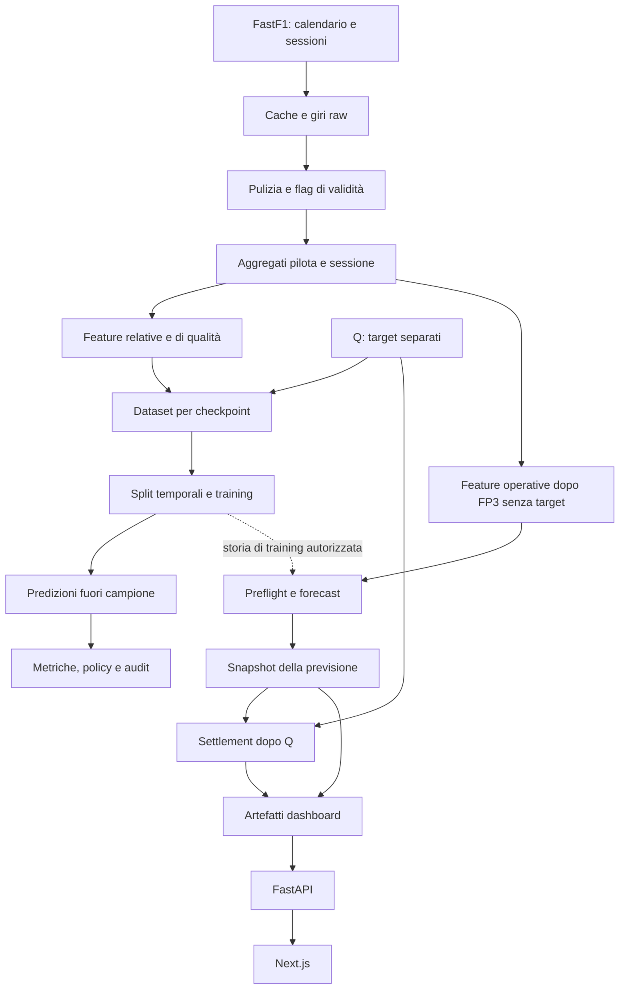
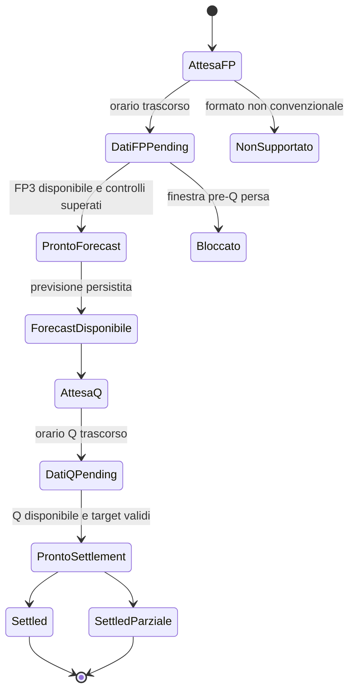

# Apex Pulse — guida tecnica e preparazione all’interview

Verifica del repository: **14–15 settembre 2026**, codice di riferimento **`b873e76`**.

Questa guida descrive il codice e gli artefatti locali effettivamente presenti. Distingue implementazione, risultati sperimentali, limiti verificati e sviluppi futuri. Non certifica lo stato corrente dei servizi remoti: il deployment riportato nel README non è stato nuovamente verificato durante questa analisi.

Le motivazioni indicate come *ragione tecnica* spiegano il compromesso dell’implementazione; non attribuiscono all’autore decisioni o esperimenti non documentati.

## Indice

1. [Presentazione del progetto](#1-presentazione-del-progetto)
2. [Cosa è implementato](#2-cosa-è-implementato)
3. [Problema matematico e target](#3-problema-matematico-e-target)
4. [Architettura e percorso dei dati](#4-architettura-e-percorso-dei-dati)
5. [Ingestion, cache e identità](#5-ingestion-cache-e-identità)
6. [Pulizia e push lap](#6-pulizia-e-push-lap)
7. [Feature engineering e checkpoint](#7-feature-engineering-e-checkpoint)
8. [Anni precedenti e pesi temporali](#8-anni-precedenti-e-pesi-temporali)
9. [Modelli e baseline](#9-modelli-e-baseline)
10. [Training e aggiornamenti](#10-training-e-aggiornamenti)
11. [Leakage-safe: significato e prove](#11-leakage-safe-significato-e-prove)
12. [Valutazione e risultati](#12-valutazione-e-risultati)
13. [Champion, shadow e governance](#13-champion-shadow-e-governance)
14. [Incertezza e conformal prediction](#14-incertezza-e-conformal-prediction)
15. [Workflow di un weekend](#15-workflow-di-un-weekend)
16. [Scheduler, tempi e concorrenza](#16-scheduler-tempi-e-concorrenza)
17. [Idempotenza, persistenza e integrità](#17-idempotenza-persistenza-e-integrità)
18. [API, frontend e deployment](#18-api-frontend-e-deployment)
19. [Qualità software e riproducibilità](#19-qualità-software-e-riproducibilità)
20. [Limiti e priorità di sviluppo](#20-limiti-e-priorità-di-sviluppo)
21. [Comandi e dimostrazione](#21-comandi-e-dimostrazione)
22. [Domande da interview](#22-domande-da-interview)
23. [Mappa delle fonti e verifica](#23-mappa-delle-fonti-e-verifica)

## 1. Presentazione del progetto

Apex Pulse stima la prestazione in qualifica dei piloti di Formula 1 partendo dalle prove libere. Il cuore è una pipeline di machine learning tabulare: acquisisce timing pubblici, costruisce feature interpretabili, confronta modelli con baseline e valuta le previsioni rispettando l’ordine temporale degli eventi.

Il valore ingegneristico comprende anche ciò che avviene intorno al modello: identità delle sessioni, qualità dei dati, separazione tra previsioni e risultati, ripetizione sicura dei workflow, conservazione degli esperimenti e pubblicazione dei risultati tramite un’API di sola lettura.

### Presentazione in circa un minuto

> Ho sviluppato una pipeline per prevedere la prestazione in qualifica della Formula 1 dai dati delle prove libere. Uso FastF1, aggrego i giri per pilota e sessione e confronto baseline di passo con Ridge, Random Forest e histogram gradient boosting. La valutazione principale è walk-forward: per ogni GP il training contiene soltanto eventi precedenti. Il riferimento operativo attuale dopo FP3 è una Random Forest con feature di passo e confronti relativi; una variante che dà priorità alla stagione corrente viene osservata separatamente. Ho implementato anche un workflow automatico che attende i dati pubblici, registra la previsione, la confronta con i target dopo la qualifica e aggiorna la dashboard. I limiti principali sono i fattori non osservabili delle prove libere, i target di qualifica semplificati e alcuni aspetti di persistenza e aggiornamento da consolidare.

Il problema è difficile perché **un tempo in prova libera non misura direttamente il potenziale in qualifica**. Carburante, programmi di lavoro, traffico e modalità della vettura influenzano il giro. Il modello cerca regolarità statistiche in osservazioni incomplete.

## 2. Cosa è implementato

| Area | Stato effettivo |
| --- | --- |
| Fonte | FastF1; nessuna dipendenza operativa da API a pagamento |
| Dataset storico locale | 2023–2025, 44 weekend selezionati, 2.634 righe, 182 colonne |
| Checkpoint di ricerca | `after_fp1`, `after_fp2`, `after_fp3` |
| Protocollo automatico corrente | `season_2026_v1`, **solo `after_fp3`** |
| Modello operativo | Random Forest, `base_plus_relative`, pesi `uniform` |
| Candidato osservato | Stessa famiglia e feature, `current_season_only_with_prior`, ruolo shadow |
| Target di training | `quali_gap_to_pole_sec` |
| Ranking | Ordinamento dei gap predetti |
| Q3 | Indicatore binario derivato dalla top 10 predetta; nessuna probabilità calibrata |
| Incertezza | Implementata nei backtest/policy; non calcolata dal percorso corrente di forecast del monitoring |
| Meteo e telemetria | Caricamento disabilitato nella configurazione; nessuna feature dedicata nella pipeline corrente |
| Interfaccia | Next.js/React/TypeScript; FastAPI serve artefatti JSON |
| Scheduler | Nel processo API, intervallo predefinito **300 secondi = 5 minuti** |
| 5 secondi | Timeout di una richiesta HTTP del frontend, non cadenza di training |
| Replay | Valutazione storica evento per evento; non streaming giro per giro |
| Sprint | Non supportate dal workflow operativo |

I nomi XGBoost, LightGBM, CatBoost, SHAP e reti neurali nelle istruzioni progettuali descrivono possibilità o obiettivi. Non vanno presentati come componenti già usati dal sistema corrente.

Il documento `reports/model_card.md` contiene anche note di milestone precedenti, per esempio una frase che esclude le dashboard. Il codice e il README mostrano che la dashboard è stata successivamente implementata. I documenti generati non sono tutti sincronizzati alla medesima revisione.

## 3. Problema matematico e target

### Unità di osservazione

Una riga del modeling dataset rappresenta:

```text
stagione × evento × checkpoint × pilota
```

Per esempio, un pilota di Monza 2024 può avere tre righe: una dopo FP1, una dopo FP2 e una dopo FP3. I target sono gli stessi; cambia l’informazione disponibile. Le tre righe non sono tre osservazioni indipendenti di tre qualifiche.

### Regressione

Concettualmente:

```text
x(d,e,c) = feature del pilota d, evento e, checkpoint c
y(d,e)   = tempo di riferimento del pilota − miglior tempo di riferimento dell’evento
y_hat    = f_c(x)
```

Il risultato è espresso in secondi. Un MAE di 0,7 s significa che, sul campione valutato, la distanza assoluta media tra gap predetto e target è di sette decimi. Non significa che ogni previsione abbia un errore massimo di sette decimi.

### La definizione realmente implementata

`build_qualifying_targets()`:

1. pulisce i giri di Q con le regole di validità;
2. prende il **miglior giro valido di ciascun pilota nell’intera sessione Q**;
3. sottrae il minimo di questi tempi per costruire il gap;
4. ordina questi tempi per costruire `quali_position`;
5. imposta `reached_q2` se esiste un tempo e la posizione è ≤15;
6. imposta `reached_q3` se esiste un tempo e la posizione è ≤10.

Questa è una **proxy della prestazione cronometrica in qualifica**, non una ricostruzione completa della classificazione ufficiale Q1/Q2/Q3.

Esempio ipotetico: un pilota eliminato in Q2 gira in 80 s sull’asciutto; in Q3 piove e il più veloce gira in 95 s. Il minimo globale può attribuire la migliore prestazione al pilota eliminato. Anche senza pioggia, ordinare i migliori tempi delle diverse fasi non preserva necessariamente l’ordine ufficiale.

I piloti senza un giro valido vengono ordinati in fondo e hanno gap mancante. Non ricevono un target di gap inventato. Le soglie 15/10 sono inoltre una semplificazione che non si adatta automaticamente a tutte le dimensioni della griglia e ai regolamenti di eliminazione.

**Risposta corretta in interview:** «Il nome della variabile è gap to pole, ma l’implementazione corrente usa il minimo dei migliori tempi validi in Q. Rendere il target coerente con le fasi ufficiali è una priorità metodologica».

### Come nasce il ranking predetto

I gap vengono ordinati dal più piccolo al più grande all’interno di evento e checkpoint. A parità di valore si usa un ordinamento deterministico per codice pilota; le predizioni mancanti finiscono in fondo.

Non viene allenato un modello learning-to-rank. Non c’è una loss che confronta esplicitamente coppie di piloti.

Il regressore non impone che il primo predetto abbia gap esattamente zero: può produrre, per esempio, 0,14 s per il primo e 0,34 s per il secondo. Non si deve leggere quel 0,14 come distacco da un altro pilota necessariamente presente nella tabella. Ridge può anche produrre valori negativi: il percorso di training generale non li corregge automaticamente.

## 4. Architettura e percorso dei dati



Il diagramma distingue due percorsi. Nel **dataset offline** feature e target possono stare nello stesso file, purché il modello riceva solo le colonne consentite. Nel **monitoring operativo** i target dell’evento corrente sono separati fisicamente dalle feature pre-Q.

| Livello | Contenuto | Motivo |
| --- | --- | --- |
| `data/raw/fastf1_cache` | Cache gestita da FastF1 | Ridurre download e parsing ripetuti |
| `data/raw/laps` | Giri esportati in Parquet per stagione/evento/sessione | Conservare input ispezionabili |
| `data/raw/session_metadata` | Identità, esito e provenienza della sessione | Non fidarsi soltanto del nome del file |
| `data/interim/clean_laps` | Giri normalizzati e flag | Separare pulizia da aggregazione |
| `data/processed/session_features` | Una riga pilota/sessione | Rendere riutilizzabili le trasformazioni |
| `data/processed/modeling` | Dataset per evento e combinato | Training e valutazione riproducibili |
| `data/processed/monitoring` | Feature FP3, target e manifest dell’evento | Separare prima e dopo Q |
| `models` | Bundle serializzati del training tabulare | Salvare estimator e liste di feature |
| `reports/metrics` | Predizioni, metriche, registri, audit e stato | Ricostruire cosa è successo |
| `reports/dashboard` | Contratti JSON per la UI | Disaccoppiare ML e presentazione |

Parquet conserva tipi e dati colonnari in modo più compatto di un CSV tipico. È adatto a dataframe e analisi locali. CSV resta utile per piccoli ledger leggibili; JSON per configurazioni, manifest e API; JSONL per aggiungere un record operativo per riga.

Questa organizzazione ricorda una separazione raw/clean/curated, ma non è un data lake distribuito. Il sistema usa principalmente file locali su disco o volume persistente.

## 5. Ingestion, cache e identità

### Dal calendario ai giri

La CLI risolve stagione, evento e sessione; FastF1 carica la sessione con i parametri configurati. Lo schema esporta le colonne di timing riconosciute, per esempio `LapTime`, settori, mescola, vita gomma, ingresso/uscita box e accuratezza.

La configurazione corrente richiede i giri e disabilita telemetria, meteo e messaggi. La presenza nel raw di campi come `SpeedST` non implica che il modello li usi: bisogna seguirli fino agli aggregati e alla selezione finale delle feature.

Gli output hanno percorsi deterministici. L’ingestion multi-sessione registra successi, errori e riutilizzo dei file; la costruzione stagionale produce un report con eventi richiesti, riusciti e falliti. La modalità di prosecuzione dopo errori serve a completare gli altri eventi rendendo visibili i fallimenti.

### Due livelli di cache

- **Cache FastF1:** evita di ripetere completamente il lavoro sul provider.
- **Artefatti della pipeline:** evitano di rifare fasi già concluse, salvo richiesta esplicita di ricostruzione dove supportata.

Un file esistente non dimostra da solo che sia aggiornato rispetto al codice o a una nuova configurazione. Per riprodurre un esperimento servono anche versioni, parametri e fingerprint. Il caching basato sull’esistenza non equivale a invalidazione automatica delle dipendenze.

### Identità stabili

`driver_key` normalizza il codice pilota; `team_key` unifica alias espliciti come Alfa Romeo/Kick Sauber o AlphaTauri/RB. Un fallback produce una chiave dal nome se l’alias non è noto.

Questo consente join coerenti tra stagioni. Resta una convenzione applicativa: codici, cambi organizzativi e nuovi nomi richiedono manutenzione. Unificare due denominazioni è anche una scelta sulla continuità storica della squadra, non una verità derivata automaticamente dai tempi.

### Perché controllare l’identità della sessione

Un file nel percorso di Silverstone potrebbe contenere dati di un altro GP: la forma tabellare sarebbe valida, ma il significato sbagliato. Il controllo raw confronta identità richiesta, percorso, metadata e contenuto disponibile. Prima del settlement verifica che i target provengano dalla Q dell’evento corretto.

Il progetto contiene record storici in quarantena, inclusi casi di ordine evento non canonico e un mismatch raw noto. Restano conservati per audit, ma non devono diventare nuove prove prospettiche. «Il file si legge» e «il dato è semanticamente corretto» sono due controlli diversi.

### Piloti delle libere e piloti da prevedere

Il sistema distingue:

- `practice_evidence_drivers`: chi ha prodotto dati nelle libere;
- `forecast_eligible_drivers`: roster autorizzato a ricevere la previsione.

Un collaudatore in FP1 non deve ricevere una posizione in qualifica se non partecipa al resto del weekend. I suoi dati possono informare gli aggregati della squadra. Non vengono attribuiti al titolare come se fossero suoi giri.

La risoluzione preferisce una fonte pre-Q recente, completa e valida, tipicamente FP3, con fallback appropriati. Duplicati, team contraddittori e roster incompleto restano errori da risolvere, talvolta ritentabili quando il provider pubblica nuovi dati.

## 6. Pulizia e push lap

### Normalizzazione

La pulizia conserva le colonne originali e aggiunge:

- identità normalizzate;
- stagione, evento e sessione;
- tempi in secondi;
- numeri di giro e stint;
- mescola e vita della gomma;
- flag `is_valid_lap` e `is_push_lap`.

Conversioni impossibili diventano valori mancanti. Non trasformare un tempo assente in zero è essenziale: zero sarebbe interpretato come una prestazione straordinaria.

### Giro valido

Il codice richiede tempo sul giro e tre settori presenti, accuratezza, giro non cancellato, assenza di ingresso e uscita box, pilota e numero giro disponibili.

Questo filtro non è un classificatore di traffico o bandiere. `TrackStatus` può essere conservato nel raw ma non è esplicitamente usato nella regola corrente. Se si invoca la funzione con input incompleti, `IsAccurate` mancante ha fallback `True`, mentre cancellazione e pit flag mancanti hanno fallback permissivi; lo schema raw normale richiede comunque alcune colonne. È un aspetto da conoscere, non un filtro infallibile.

### Giro push-like

Fra i giri validi, una lap viene marcata push-like se:

```text
tempo_giro ≤ 1,03 × miglior_tempo_valido_del_pilota
e
tempo_giro ≤ 1,07 × miglior_tempo_valido_della_sessione
e
mescola ∈ {SOFT, MEDIUM, HARD, INTERMEDIATE, WET}
```

Esempio: migliore del pilota 90 s, migliore di sessione 89 s. I limiti sono 92,70 e 95,23 s; la lap deve rispettare entrambi. Un 92 s passa, un 93 s no.

La ragione tecnica è escludere giri palesemente poco rappresentativi senza introdurre subito un modello di riconoscimento dei programmi. Le soglie sono configurabili e spiegabili.

**Limiti:** un long run veloce può essere incluso; traffico moderato può restare; un cambiamento asciutto/bagnato può rendere il miglior tempo globale un confronto inappropriato. I flag sono una proxy dell’intento del pilota, non la sua osservazione.

Nel lavoro per checkpoint il migliore della sessione è lecito perché la sessione è terminata. Per un futuro replay giro per giro bisognerebbe ricalcolarlo solo sui giri già osservati, senza usare il migliore finale.

## 7. Feature engineering e checkpoint

### Aggregati pilota/sessione

La pipeline costruisce conteggi di giri totali, validi e push, conteggi per mescola, tempi migliori, mediane, deviazioni standard, migliori settori, theoretical best e informazioni sulla vita gomme.

Il **theoretical best** è:

```text
min(settore 1 valido) + min(settore 2 valido) + min(settore 3 valido)
```

I tre settori possono provenire da giri diversi. È una stima dell’assemblaggio ideale dei settori osservati; non dimostra che quel giro fosse fisicamente realizzabile nelle stesse condizioni.

`best_vs_theoretical_gap_sec` quantifica la distanza fra il migliore giro valido e la somma dei migliori settori. Può suggerire esecuzione imperfetta, ma non identifica causalmente traffico o errore di guida.

Alcuni dettagli importanti:

- `best_lap_time_sec` usa il minimo raw temporizzato, anche se quel giro non passa tutti i filtri;
- `best_valid_lap_time_sec` e `best_push_lap_time_sec` sono variabili diverse;
- mescola e vita della gomma del best lap sono ricavate dal giro raw più veloce;
- i conteggi SOFT/MEDIUM/HARD comprendono i giri della mescola nel gruppo, non solo i push;
- non è implementata una specifica feature di trend di miglioramento durante la sessione.

### Feature relative

Per best valid, best push e theoretical best si costruiscono gap, rapporti e ranking rispetto alla sessione, nonché confronti con compagno e team.

```text
gap_sessione = tempo_pilota − minimo_sessione
gap_relativo = gap_sessione / minimo_sessione
gap_compagno = tempo_pilota − miglior_tempo_degli_altri_del_team
```

`gap_pct` nel nome identifica un rapporto: 0,01 corrisponde all’1%, non al valore numerico 1.

Il segno del gap al compagno è informativo: negativo significa più veloce. Nei dati con più partecipanti dello stesso team, il riferimento è il migliore degli altri. Le feature correnti usano soprattutto **team best**, non una decomposizione causale driver/car e non un team average generalizzato.

I confronti relativi attenuano l’effetto della lunghezza del circuito e delle condizioni condivise. Non cancellano differenze di carburante, orario del run o gomme.

### Feature di qualità

Esprimono disponibilità delle sessioni, numero di giri, assenza del segnale più recente e gap estremi. Lo score di qualità somma sei condizioni binarie:

1. best push recente presente;
2. best valid recente presente;
3. theoretical best recente presente;
4. almeno due push lap nella sessione più recente;
5. almeno cinque giri validi nella sessione più recente;
6. confronto relativo al team disponibile.

Il punteggio è quindi 0–6. Non è una probabilità di correttezza della previsione. La soglia di gap estremo è 3 s.

### Checkpoint e colonne

| Checkpoint | Sessioni consentite |
| --- | --- |
| `after_fp1` | FP1 |
| `after_fp2` | FP1, FP2 |
| `after_fp3` | FP1, FP2, FP3 |

Il dataset largo usa prefissi `fp1_`, `fp2_`, `fp3_`. Il builder unisce solo le sessioni consentite; la selezione del modello filtra nuovamente i prefissi. Le colonne future possono esistere nello schema combinato ma non entrare nell’input di quel checkpoint.

### Quali feature entrano davvero nel modello

Sono ammesse le feature numeriche e booleane dei gruppi consentiti, con almeno un valore osservato nel training. Gli identificatori e i target sono esclusi. Non è presente un encoder categorico generale: `best_lap_compound` può essere nel dataset ma la stringa non viene direttamente usata da questi regressori. Conteggi delle mescole e tyre life numerica forniscono comunque informazione sulle gomme.

I gruppi di ablation sono costruiti tramite pattern nei nomi delle colonne. Le combinazioni principali sono `base_lap_features`, `base_plus_relative`, `base_plus_historical`, `base_plus_quality`, `all_features`.

Il gruppo operativo **`base_plus_relative` non include le rolling feature storiche**. Gli anni passati contribuiscono comunque come esempi di training. Questo punto evita di confondere «allenato su più stagioni» con «usa la media storica del pilota come feature».

La selezione corrente sul dataset locale produce 161 feature numeriche utilizzabili dopo FP3 nell’insieme completo e 126 in `base_plus_relative`. Sono conteggi sullo snapshot e sul selettore attuale, non una prova che ogni artefatto storico sia stato allenato con lo stesso numero di colonne. Fa fede il manifest del singolo training.

## 8. Anni precedenti e pesi temporali

Gli anni precedenti possono entrare in **tre modi distinti**.

### A. Esempi supervisionati

Un evento passato fornisce una coppia `(feature delle libere, target della qualifica)`. La Random Forest impara da tante coppie precedenti. Non carica necessariamente un modello 2023 da aggiornare con un modello 2024: normalmente viene creato un nuovo estimator e chiamato `fit()` sull’insieme di training consentito.

### B. Feature di forma storica

Il modulo storico calcola per pilota e team medie/mediane mobili degli ultimi 3 o 5 eventi osservati, medie cumulative, frequenza Q3 e gap storico al compagno.

Il procedimento temporale è:

```text
per ogni evento ordinato:
    calcola le feature usando la storia già raccolta
    solo dopo aggiungi il risultato di questo evento alla storia
```

È l’equivalente concettuale di uno `shift(1)` prima della rolling aggregation. Il codice lo realizza con una lista di storia, non necessariamente con una chiamata a `shift`.

Se i gap precedenti sono 0,4, 0,8 e 0,6 s, la rolling3 prima del GP successivo vale 0,6 s. Il risultato ancora sconosciuto del GP corrente non può cambiare quel valore.

La storia è deduplicata per pilota/evento: i tre checkpoint non devono contare tre volte. Per il team si aggregano prima i risultati dei piloti nello stesso evento. La storia attraversa le stagioni e non viene azzerata automaticamente a gennaio. «Ultimi tre eventi» significa ultimi tre eventi disponibili nel dataset per quell’entità, non necessariamente gli ultimi tre round del calendario completo.

Se manca storia, le statistiche restano mancanti e i conteggi indicano la scarsità. `min_periods=1` permette una prima stima già con un evento valido. Gli eventi esclusi dal ruolo di fonte, per esempio un holdout, non vengono aggiunti alla storia.

### C. Peso diverso degli esempi

| Policy | Regola |
| --- | --- |
| `uniform` | Ogni riga di training ha peso 1 |
| `season_priority` | Stagione del test: 1; precedente: 0,35; più vecchie: 0,10 |
| `exponential_recency` | `peso = 0,5^(distanza_eventi / 10)` |
| `current_season_only_with_prior` | Prima di 5 eventi precedenti della stagione usa i pesi stagionali; dopo, conserva solo la stagione corrente |

Per un target 2026, 2025 riceve 0,35 e 2024/2023 ricevono 0,10 nella policy stagionale. Se fossero già disponibili cinque eventi 2026 legalmente utilizzabili, la policy `current_season_only_with_prior` eliminerebbe dal training supervisionato le righe delle stagioni precedenti.

Il termine *prior* descrive un supporto storico nel cold start. Non è un prior bayesiano esplicito con posterior analitico.

Ridge, Random Forest e histogram boosting accettano i pesi nei rispettivi percorsi. Le baseline costanti mean/median del percorso tabulare non vengono trasformate in statistiche pesate: questa differenza è dichiarata dal modulo.

Il peso per riga non rende uguale il contributo di ogni evento se il numero di piloti validi cambia. L’**effective sample size** riportato è `(somma pesi)^2 / somma(pesi^2)`: misura la concentrazione dei pesi, non il numero di osservazioni temporalmente indipendenti.

La ragione tecnica del confronto è il compromesso tra volume storico e cambiamento del regime competitivo. Più anni aiutano la stabilità, ma vetture e gerarchie cambiano. Scartare troppo presto il passato aumenta invece la varianza.

## 9. Modelli e baseline

### Baseline di passo

Sono implementate sei varianti: best push, best valid, theoretical best e le corrispondenti versioni robuste.

Per ciascun pilota si usa la metrica dell’ultima sessione consentita; se manca, si arretra: FP3 → FP2 → FP1. Le versioni robuste scartano anche un segnale con gap di sessione >3 s e cercano una sessione precedente. Dal valore selezionato viene sottratto il migliore del gruppo per ottenere il gap predetto.

Questa baseline **non prende semplicemente il minimo di tutte le libere**. Privilegia la sessione più recente. E non è un modello allenato: applica una regola.

Il fallback può confrontare tempi di sessioni diverse, un limite quando la pista cambia. Se nessuna misura è utilizzabile, il gap resta assente e il ranking mette il pilota in fondo. Valutare soltanto gli errori numerici disponibili può favorire metodi con minore copertura: vanno sempre confrontati anche i denominatori.

Le baseline «qualifica del GP precedente» e «rolling form» sono obiettivi delle istruzioni iniziali, ma non compaiono come metodi autonomi nel generatore corrente. Esistono invece feature storiche e baseline costanti mean/median target.

### Ridge Regression

Ridge stima una relazione lineare regolarizzata:

```text
min_beta Σ_i w_i (y_i − x_i beta)^2 + alpha ||beta||²
```

Pipeline: imputazione con mediana → standardizzazione → Ridge con `alpha=1`.

La standardizzazione rende confrontabili le scale delle feature ai fini della penalizzazione. La regolarizzazione riduce coefficienti eccessivi, utile con molte feature correlate. Il limite è l’incapacità di rappresentare direttamente interazioni e non linearità complesse.

### Random Forest

La regressione è la media delle predizioni di più alberi. Nel costruttore corrente:

- 200 alberi;
- profondità massima 8;
- almeno 2 campioni per foglia;
- seed 42;
- `n_jobs=1`;
- imputazione con mediana, senza standardizzazione.

Gli alberi dividono lo spazio delle feature con soglie. Possono rappresentare condizioni come «un buon gap relativo è informativo soprattutto quando esistono sufficienti giri rappresentativi», senza specificare a mano ogni interazione.

Bootstrap e media fra alberi riducono la varianza rispetto a un singolo albero. Il codice non passa un valore personalizzato per tutte le opzioni, per esempio `max_features`: non bisogna raccontare configurazioni non presenti. Profondità e foglie limitano la complessità; un singolo worker limita la competizione per risorse nel runtime.

Le predizioni della foresta tendono a medie osservate nelle foglie. Questo aiuta la stabilità ma rende debole l’estrapolazione verso regimi mai visti. Gli errori possono restare correlati fra piloti dello stesso evento.

### Histogram Gradient Boosting

`HistGradientBoostingRegressor` costruisce alberi in sequenza per migliorare progressivamente l’obiettivo di regressione; le feature numeriche vengono trattate con una rappresentazione a bin. La configurazione è:

```text
max_iter = 200
learning_rate = 0,05
max_leaf_nodes = 31
l2_regularization = 0,1
random_state = 42
```

È un confronto non lineare aggiuntivo disponibile in scikit-learn. Non è XGBoost e non è LightGBM. Il progetto evita così una dipendenza esterna ulteriore per questo esperimento.

### Perché partire da modelli tabulari

Ci sono pochi eventi indipendenti, molte variabili interpretabili e poco bisogno di una rappresentazione appresa da immagini o testo. Baseline e alberi permettono cicli rapidi di verifica, minori requisiti hardware e diagnosi più semplici. Il valore va cercato prima in target, dati e validazione; la complessità del modello non sostituisce questi elementi.

L’ottimizzazione dei regressori usa normalmente errore quadratico, mentre la selezione principale usa MAE. Sono obiettivi differenti: l’allenamento può dare più peso agli outlier di quanto suggerisca la metrica con cui poi si confrontano i metodi.

## 10. Training e aggiornamenti

### Training offline

Il comando `train-tabular-models` legge il dataset combinato, verifica la quantità minima di eventi, costruisce un holdout e ricalcola la storia escludendo gli eventi di test come fonti. Di default tiene fuori l’ultimo evento. È possibile richiedere eventi o una stagione.

Per ciascun checkpoint:

1. seleziona le righe di training con target disponibile;
2. seleziona le feature numeriche lecite e non interamente mancanti nel training;
3. allena imputazione e, per Ridge, scaler **solo sul training**;
4. esegue `fit` del regressore;
5. predice sul test;
6. deriva ranking e indicatore Q3;
7. salva predizioni, metriche, lista delle feature ed estimator.

I bundle del comando tabulare sono `models/ridge_gap_model.joblib` e `models/random_forest_gap_model.joblib`. Contengono modelli per checkpoint con preprocessing e feature associate. Non sono automaticamente promossi a serving dal solo fatto di esistere.

### Backtest

Il walk-forward ripete il training su una storia crescente. Con cinque eventi iniziali:

```text
train E1…E5  → predici E6
train E1…E6  → predici E7
train E1…E7  → predici E8
```

Il modello viene ricreato per il fold. Non si tratta di `partial_fit`, non viene modificato un albero a ogni giro e non c’è fine-tuning di una rete neurale.

### Training del forecast operativo

`create_prospective_monitoring_forecast()` legge il dataset indicato nel protocollo e aggiunge le feature prive di target dell’evento corrente. Ricostruisce la storia lecita, poi `train_monitoring_event_sources()` allena **due Random Forest**: uniform e candidata season-aware. La prima alimenta la previsione osservata; entrambe alimentano i confronti shadow.

Quindi la policy è congelata, ma **i parametri stimati possono essere ricalcolati quando si crea un nuovo forecast**. «Static policy» non significa «stesso oggetto estimator per sempre». Il percorso operativo non si limita a caricare il file `.joblib` del comando tabulare.

Quando esiste già un forecast valido, il normale tick lo riutilizza e non lo riallena a ogni esecuzione.

### Cosa cambia dopo un GP

| Oggetto | Aggiornamento |
| --- | --- |
| Feature del prossimo evento | Ricostruite dai dati delle sue libere |
| Target dell’evento concluso | Aggiunti separatamente dopo Q e validati |
| Errori e ledger di evidenza | Aggiornati dal settlement |
| Forecast già registrato | Conservato; non corretto in base al risultato |
| Modello del prossimo forecast | Nuovo fit sulla storia effettivamente disponibile e autorizzata |
| Policy e soglie del protocollo | Non promosse/modificate automaticamente dai risultati |
| Dashboard | Rigenerata dagli artefatti del workflow, poi riletta dalla UI |

### Limite verificato: apprendimento dalla stagione corrente

Il codice ammette nel training gli eventi precedenti della stagione monitorata soltanto se risultano settled e riconciliati. **Tuttavia, nel percorso corrente non c’è un passaggio automatico che unisce le nuove feature e i nuovi target del monitoring al dataset storico combinato.**

`monitoring_dataset_for_forecast()` carica il dataset del protocollo e vi aggiunge l’evento corrente senza target. Non ricostruisce lì tutte le righe supervisionate dei GP monitorati precedenti. Il settlement aggiorna i propri ledger, non il file storico combinato.

Nello snapshot ispezionato, il combinato contiene soltanto 2023–2025. I manifest locali dei forecast riportano una storia di 44 eventi. Il contatore di 2.634 righe nel manifest comprende i checkpoint della storia passata alla procedura; il fit effettivo del modello FP3 filtra poi solo FP3 e i target non mancanti: sul combinato attuale sono **873 righe**, non 2.634 campioni FP3.

La risposta accurata è: «Il sistema riaddestra per il nuovo evento e accumula evidenza dal settlement. Per includere automaticamente i nuovi GP come esempi supervisionati serve completare e validare l’aggiornamento del dataset di training». Non è corretto affermare che oggi impari automaticamente da ogni nuovo risultato nel dataset combinato.

## 11. Leakage-safe: significato e prove

### Definizione

**Data leakage** significa usare, direttamente o indirettamente, informazioni che non sarebbero disponibili al momento della previsione, oppure lasciare che il test influenzi l’allenamento o la scelta del metodo. Il risultato tipico è una stima delle prestazioni troppo ottimistica.

«Leakage-safe» descrive un insieme di contratti e verifiche sul flusso informativo. Non è una proprietà magica della Random Forest e non è una certificazione generale di qualunque uso della repository.

Esempi di errori:

- dare al modello la Q dello stesso GP;
- usare FP3 per una previsione dopo FP2;
- calcolare una media stagionale includendo GP futuri;
- inserire piloti dello stesso evento sia in train sia in test;
- imputare le mediane su tutto il dataset prima dello split;
- scegliere il modello migliore osservando il risultato del GP che si sta valutando;
- costruire un intervallo usando l’errore appena commesso sul medesimo GP.

La documentazione [scikit-learn sul leakage e sul preprocessing](https://scikit-learn.org/stable/common_pitfalls.html#data-leakage) conferma la necessità di apprendere le trasformazioni solo sul training e usare `Pipeline` per applicarle coerentemente.

### Difese presenti

| Rischio | Meccanismo nel progetto |
| --- | --- |
| Target fra i predittori | Liste di colonne target e selettori di feature ammessi |
| Sessioni future | Prefissi consentiti per checkpoint nel builder e nella selezione numerica |
| Risultato attuale nelle rolling | Storia calcolata prima di aggiungere l’esito dell’evento |
| Tre checkpoint dello stesso GP divisi fra train/test | Split per evento |
| Training su GP futuri | Walk-forward su ordine stagione/round |
| Imputazione/scaling sul test | Preprocessing dentro la pipeline allenata sul train |
| Scelta del candidato col risultato corrente | Evidenza di fold precedenti e confronti su chiavi allineate |
| Target correnti nel forecast operativo | Artefatto di feature senza target, preflight e controlli sugli artefatti Q |
| GP monitorato non ancora concluso usato come evidenza | Settlement richiesto e ordine dal registry |
| Confusione fra prove vere, legacy e sintetiche | Riconciliazione e quarantena |

Usare la qualifica di Monza dell’anno prima per prevedere Monza di quest’anno può essere lecito. Usare la qualifica del GP corrente non lo è. La regola riguarda **quando l’informazione è disponibile**, non soltanto il nome della colonna.

### Le qualificazioni necessarie

**1. Event holdout non implica training cronologico.** Il generatore generico mette nel train tutti gli eventi non selezionati, anche quelli successivi. Il season holdout generico fa lo stesso con le stagioni non escluse. Sono split senza sovrapposizione dei gruppi, ma non garantiscono da soli una simulazione del futuro. Per questa affermazione bisogna usare walk-forward, gli split prospettici dedicati o un dataset già ristretto alle sole stagioni precedenti.

**2. `uniform` non filtra da solo il futuro.** Il modulo dei pesi assume che il caller abbia fornito un train corretto. Le altre policy fanno un filtro temporale aggiuntivo. I pesi non sostituiscono la validazione dello split.

**3. L’ordine deve essere corretto.** Se manca `event_order`, alcune utility offline usano l’ordine di comparsa nel dataset. Un file riordinato male può quindi compromettere la cronologia. Il monitoring è più rigido: usa il registry e blocca ordini non validi o duplicati.

**4. Lo storico offline non è una ricostruzione perfetta delle versioni pubblicate nel tempo.** I raw FastF1 possono essere scaricati o corretti dopo l’evento. Conservare snapshot e timestamp di disponibilità renderebbe più forte una dimostrazione point-in-time; il solo ordine dei GP non ricostruisce tutte le revisioni del provider.

**5. La popolazione offline viene costruita dai target Q.** Serve per il dataset supervisionato, ma non dimostra che quel roster sarebbe stato noto a FP1. Il monitoring risolve invece una entry list pre-Q. La parità tra popolazione di ricerca e popolazione servita è un controllo separato.

**6. Scoperta retrospettiva e prova prospettica sono distinte.** Scegliere feature e iperparametri dopo molti backtest può adattare il progetto agli stessi dati anche senza una colonna di target nel modello. Per questo il repository conserva policy congelate e osservazioni successive separate.

### Limite sul momento esatto di pubblicazione

L’orchestratore blocca un nuovo forecast se **all’istante del tick** Q risulta già iniziata. Il controllo di basso livello `assert_pre_qualifying_window_artifacts()` verifica la presenza locale di giri/metadata Q, non il tempo attuale rispetto al calendario. Non c’è in quel punto un secondo controllo del calendario immediatamente prima del salvataggio finale dopo download e training.

Negli artefatti locali dell’Hungarian Grand Prix 2026 compare una previsione creata alle **14:01:53 UTC del 25 luglio**, mentre lo snapshot di calendario indica inizio Q alle **14:00 UTC**. Questo non dimostra che il modello abbia letto i target Q. Dimostra però che **isolamento dei target e pubblicazione strettamente prima dell’inizio di Q non sono la stessa garanzia**, e quella previsione non documenta da sola una pubblicazione pre-Q in senso rigoroso.

Per rafforzare il contratto servono una deadline verificata anche al commit, un margine di esecuzione, timestamp di disponibilità delle fonti e una classificazione esplicita dei forecast tardivi. Le verifiche presenti difendono molti percorsi di leakage; non giustificano dire «nessun leakage possibile in ogni scenario».

## 12. Valutazione e risultati

### Quanto è grande il dataset

| Stagione | Eventi selezionati | Righe, includendo i tre checkpoint |
| --- | ---: | ---: |
| 2023 | 14 | 840 |
| 2024 | 12 | 714 |
| 2025 | 18 | 1.080 |
| Totale | 44 | 2.634 |

Ci sono 878 righe per checkpoint, 15 righe complessive con gap target mancante, nessun duplicato sulla chiave stagione/evento/checkpoint/pilota nel file verificato. Le 15 assenze corrispondono a cinque righe pilota/evento senza gap, ripetute nei tre checkpoint.

Il preset `conventional` è una lista esplicita di eventi per le stagioni supportate. **Non significa che siano stati inclusi tutti i GP convenzionali di ciascun anno.** Il report di costruzione registra 44 eventi richiesti e 44 riusciti; questo non misura la copertura rispetto all’intero calendario.

Il numero realmente limitante per la generalizzazione è soprattutto quello dei weekend, non soltanto quello delle righe. I piloti dello stesso evento condividono condizioni e gli anni possono avere regimi differenti.

### Protocolli da non confondere

| Protocollo | Che cosa misura | Limite principale |
| --- | --- | --- |
| Event holdout | Generalizzazione a eventi esclusi dal train | Può usare altri eventi successivi |
| Season holdout generico | Generalizzazione a una stagione esclusa | Va vincolato esplicitamente al passato |
| Walk-forward | Evento futuro rispetto alla storia di ogni fold | Scelte progettuali possono essere retrospettive |
| Valutazione di policy su artefatti | Profilo congelato applicato a predizioni salvate | Dipende dalla corretta provenienza degli artefatti |
| True prospective replay | Riaddestramento evento per evento su storia lecita | Rimane una ricostruzione storica |
| Monitoring prospettico | Forecast conservato e valutato in seguito | Richiede prova temporale e integrità delle fonti |

Nel walk-forward principale, 44 eventi meno 5 iniziali danno 39 fold. La crescita del train è deliberata: simula un sistema che dispone progressivamente di più storia.

### Metriche

| Metrica | Interpretazione |
| --- | --- |
| MAE gap | Media di `abs(predetto − vero)` in secondi |
| RMSE gap | Radice della media dell’errore quadratico; penalizza di più gli errori grandi |
| Median absolute error | Errore mediano; meno influenzato da pochi eventi estremi |
| Mean absolute position error | Numero medio di posizioni sbagliate |
| Spearman | Concordanza dell’ordine, mediata fra eventi |
| `top_3/5/10_accuracy` | In questo codice: quota dei veri top-k ritrovata nei top-k predetti |
| `q3_accuracy` | Correttezza dell’indicatore Q3 derivato dal ranking |

Il nome `top_k_accuracy` non indica l’ordine esatto dei primi k. Se i veri primi tre sono A/B/C e si prevedono B/A/C, questa metrica vale 100%, pur sbagliando il vincitore e due posizioni.

ROC-AUC, log loss, Brier score e calibrazione delle probabilità Q3 sono obiettivi sensati per un classificatore futuro, ma non sono le metriche di un classificatore probabilistico già presente. Kendall tau compare negli obiettivi iniziali, non nel calcolatore corrente delle metriche base.

MAE/RMSE sono aggregate sulle righe valutabili; Spearman e top-k vengono calcolate per evento e poi mediate. Questa differenza di ponderazione può spiegare perché medie lette in report diversi non coincidano esattamente.

### Risultato retrospettivo principale

Confronto allineato dopo FP3, stessa Random Forest e gruppo `base_plus_relative`, **774 righe su 39 eventi**:

| Training | MAE gap |
| --- | ---: |
| Uniform | 0,9199 s |
| `current_season_only_with_prior` | 0,7291 s |
| Differenza candidata − uniform | −0,1908 s, circa −20,7% |

Fonte: `season_aware_validation_summary.json`. Questo è il confronto fra **candidati fissi**, non la prestazione garantita della policy pubblicata.

Il report di stabilità indica miglioramento nel 48,7% degli eventi; circa il 73,1% del beneficio totale proviene dai tre eventi più favorevoli. Nel 2023 non c’è miglioramento, nel cold start l’evidenza è debole. Questi dettagli rendono il risultato più informativo della sola media.

### Policy congelate valutate su artefatti

| Separazione dichiarata dai report | FP3 static | FP3 season-aware frozen |
| --- | ---: | ---: |
| Storia 2023 / valutazione 2024 | 0,946 s | 0,951 s |
| Storia 2023–2024 / valutazione 2025 | 0,788 s | 0,528 s |

Queste righe provengono dalla **valutazione di policy sui risultati salvati**. La parola *frozen* riguarda il profilo decisionale. Non bisogna raccontarle come prova che un unico estimator allenato una sola volta prima della stagione abbia necessariamente prodotto tutti quei valori.

### Replay con vero riaddestramento

Nei report di true replay, static, guarded e season-aware producono la stessa MAE FP3: circa 0,946 s sul 2024 e 0,788 s sul 2025. Non sono emerse selezioni live della candidata nei due replay originali.

Un audit ha distinto quattro cose: candidata allenata, predizione conservata, evidenza precedente disponibile e candidata selezionata. In una versione del percorso, le predizioni della candidata non selezionata non venivano conservate come storia utile, impedendo di accumulare le prove richieste dai gate. È stata aggiunta persistenza shadow diagnostica, senza riscrivere il risultato originale delle policy.

Con la storia shadow, il report di governance rileva eleggibilità controfattuale su 2 eventi del test 2024 e 13 del test 2025. **Controfattuale** significa «la regola avrebbe potuto selezionarla usando questa storia», non «la produzione l’ha realmente selezionata».

Perciò il risultato operativo resta conservativo: `retain_static_policy` / `candidate_requires_more_live_prospective_evidence`, secondo il livello del report.

### Come difendere i numeri

Per ogni risultato bisogna poter indicare: target, checkpoint, eventi, righe valutate, trattamento dei mancanti, split, candidato/policy, fonte e natura retrospettiva o prospettica. Un buon confronto usa le stesse chiavi pilota/evento e lo stesso denominatore.

I numeri qui riportati sono stati **letti dagli artefatti esistenti**, non rigenerati allenando tutte le varianti durante la scrittura della guida. Dopo modifiche alle feature, confrontare codice corrente e vecchi report richiede un rebuild tracciato.

## 13. Champion, shadow e governance

Un **modello** è una funzione allenata. Una **policy** decide quale metodo usare in una certa situazione. Un **champion** è il metodo di riferimento selezionato dalla policy. Una **shadow prediction** è calcolata e conservata per valutarla, ma non determina l’output operativo.

### Le modalità di selezione

| Modalità | Idea |
| --- | --- |
| `static` | Metodo fissato per checkpoint |
| `nested` | Scelta usando evidenza di fold precedenti |
| `stabilized_nested` | Richiede quantità minima di storia e margine di miglioramento |
| `stabilized_nested_guarded` | Aggiunge vincoli, tra cui il divieto di passare a baseline di passo in FP3 |
| `season_aware_nested_guarded` | Ammette una candidata temporale specifica con ulteriori gate |

Nel progetto *nested* identifica questo meccanismo di selezione prior-only. Non va confuso automaticamente con una ricerca esaustiva di iperparametri tramite nested cross-validation classica.

La policy statica configurata è:

```text
FP1: robust_best_push_lap
FP2: robust_theoretical_best_lap
FP3: Random Forest / base_plus_relative
```

I checkpoint iniziali hanno segnali più incerti. La scelta di baseline trasparenti è coerente con l’evidenza che più complessità non produce necessariamente più accuratezza in FP1/FP2.

### Gate della candidata stagionale

Richiedono:

- checkpoint FP3;
- identità esatta della candidata;
- almeno 5 eventi precedenti della stagione corrente;
- almeno 5 fold precedenti utili;
- almeno 100 predizioni precedenti allineate;
- miglioramento MAE di almeno 0,05 s rispetto al riferimento sul confronto previsto.

La soglia di cinque eventi nel training e quella nei gate hanno ruoli differenti: una decide **quali righe allenano il modello**, l’altra **quando le prove permettono una selezione**. Il margine di 0,05 s riduce cambi frequenti per vantaggi piccoli; non è un p-value o un test statistico di significatività.

### Protocollo corrente

`season_2026_v1` registra stagione monitorata, stagioni storiche, checkpoint, identità di default/candidata, configurazioni e fingerprint. Il forecast operativo persiste tre ruoli:

1. `observed_live_policy`: Random Forest uniform;
2. `uniform_default_shadow`: riferimento diagnostico;
3. `season_aware_weighted_candidate_shadow`: candidata diagnostica.

Il codice che costruisce il ruolo live prende esplicitamente `source["static"]`. Anche se la candidata passa un controllo di eleggibilità, questo non la promuove automaticamente nel percorso operativo corrente.

Congelare un protocollo significa poter confrontare in seguito la decisione con regole dichiarate prima dei risultati. L’hash ne verifica la coerenza interna, ma non sostituisce il controllo che configurazione effettivamente passata al training, versione del codice e manifest corrispondano al contratto congelato. Il training riceve ancora un `ModelConfig`: cambiare file di configurazione non va trattato come una modifica irrilevante.

## 14. Incertezza e conformal prediction

Una previsione puntuale dice «0,8 s». Un intervallo dice, per esempio, «da −0,1 a 1,7 s secondo questo metodo di calibrazione». Il secondo descrive variabilità attesa degli errori, non modifica il ranking puntuale.

Nei backtest sono presenti tre metodi:

- `residual_std`: semiampiezza circa `1,64 × deviazione_standard_residui`;
- `conformal`: quantile dei residui assoluti precedenti;
- `conformal_predicted_gap_bucket`: quantile condizionato a gruppi scelti dal gap **predetto**.

### Meccanismo dei quantili

Per ogni previsione corrente si raccolgono errori fuori campione precedenti:

```text
r_i = abs(y_i − y_hat_i)
q = quantile_0,90(r_precedenti)
intervallo = [y_hat − q, y_hat + q]
```

Il codice usa `quantile(..., interpolation="higher")`, con almeno 20 residui nel gruppo selezionato. Se manca storia sufficiente, l’intervallo rimane assente.

I bucket distinguono gap predetti fino a 0,5 s, 1,5 s, 3 s e oltre. Il fallback va dal gruppo più specifico — checkpoint, metodo e bucket — fino al pool globale. Se il gruppo ristretto è troppo piccolo, si usa un gruppo più ampio.

Il bucket usa il valore predetto perché il gap vero del GP corrente è ancora sconosciuto. Scegliere la classe di calibrazione dal risultato reale sarebbe leakage. Nei report, il risultato reale viene usato successivamente per misurare copertura, non per scegliere la larghezza dell’intervallo.

### Garanzie e limiti

La conformal prediction formale può fornire garanzie di copertura sotto ipotesi appropriate e con il corretto quantile a campione finito; si veda [Angelopoulos e Bates, introduzione alla conformal prediction](https://arxiv.org/abs/2107.07511). La serie temporale F1 cambia regime, e il quantile empirico implementato non coincide automaticamente con un protocollo split-conformal completo con correzione finita.

Perciò è corretto parlare di **intervalli empirici da residui precedenti, ispirati alla calibrazione conformal**, e verificarne la copertura effettiva. «90% nominale» non significa «90% garantito per ogni pilota, circuito e condizione». Intervalli molto larghi possono coprire molti risultati restando poco utili.

Un estremo inferiore negativo è possibile perché l’intervallo è simmetrico e non impone automaticamente il vincolo fisico del gap. Clippare a zero cambierebbe il metodo e richiederebbe una nuova valutazione.

**Stato operativo:** il forecast corrente del monitoring non richiama il calcolo degli intervalli. Nel JSON locale dell’evento esaminato `uncertainty_method` è `null` e gli intervalli risultano non disponibili. La UI sa rappresentarli, ma il supporto di schema/UI non dimostra che vengano prodotti dal modello live.

## 15. Workflow di un weekend

### Prima della qualifica

Il workflow `monitoring-before-qualifying`:

1. risolve l’identità del GP e il round dal calendario;
2. acquisisce FP1, FP2, FP3;
3. risolve il roster e la parità delle identità;
4. costruisce feature operative FP3 senza target;
5. registra l’evento e la provenienza;
6. esegue il preflight;
7. crea o riutilizza il forecast;
8. esporta gli artefatti dashboard.

**Preflight** è il controllo prima dell’operazione: protocollo, registry, ordine, file di feature, fingerprint, colonne consentite e stato degli artefatti. Fallire un controllo obbligatorio impedisce la creazione della previsione.

Le feature operative si trovano in un file come:

```text
data/processed/monitoring/2026/<evento>/monitoring_fp3_features.parquet
```

### Dopo la qualifica

`monitoring-after-qualifying`:

1. acquisisce Q;
2. verifica l’identità raw;
3. costruisce o riutilizza target separati;
4. effettua il settlement del forecast preesistente;
5. verifica la parità raw→target;
6. controlla integrità e popolazioni;
7. esporta la dashboard aggiornata.

**Settlement** significa associare alla previsione conservata l’esito osservato e calcolare gli errori. Non è un riaddestramento e non corregge la previsione retroattivamente.

Il join usa chiavi evento/checkpoint/pilota normalizzato, non l’ordine delle righe. Se due file ordinano i piloti diversamente, il risultato resta corretto. Un semplice affiancamento per indice sarebbe pericoloso.

### Copertura parziale

Si distinguono piloti previsti, piloti con target e piloti valutabili. Un pilota previsto senza target rimane nel registro, con motivo di esclusione; non si imputa il suo risultato per migliorare la completezza apparente. Le righe non valutabili sono escluse dalle metriche e dall’evidenza futura.

`SETTLED_PARTIAL_COVERAGE` è uno stato esplicito. Un MAE su 19 piloti non va raccontato come risultato su tutta la griglia se i mancanti sono proprio i casi più difficili. La copertura può avere un bias di selezione.

### Calendario, disponibilità e dati validi

Sono tre fatti diversi:

```text
la sessione dovrebbe essere terminata
→ il provider ha pubblicato dati
→ i dati superano i controlli necessari
```

Il probe FastF1 controlla la presenza dei giri e, per Q, un minimo di righe di risultati. È un controllo preliminare, non la certificazione completa del dataset. I controlli successivi su roster, identità e target restano necessari.

Se Q è già iniziata senza un forecast, il normale orchestratore produce `forecast_window_missed`. L’intento è perdere la previsione piuttosto che creare a posteriori un risultato presentato come precedente. I limiti di deadline descritti nella sezione 11 spiegano dove rafforzare questo comportamento.

## 16. Scheduler, tempi e concorrenza

### I quattro orologi da ricordare

| Parametro | Valore predefinito | Significato |
| --- | ---: | --- |
| Tick scheduler | 300 s | Attesa fra il completamento di un tick e il successivo |
| Ritardo iniziale | 10 s | Attesa dopo l’avvio del processo |
| Refresh frontend | 60 s | Richiesta di aggiornamento dei dati visualizzati |
| Timeout HTTP frontend | 5 s | Tempo massimo di attesa di una singola richiesta API |

Il minimo configurabile per l’intervallo scheduler è 60 s. **Non esiste una finestra di idempotenza di cinque secondi.** La frequenza, il timeout e l’idempotenza risolvono problemi diversi.

### Com’è implementato

FastAPI avvia `AutopilotScheduler` nel proprio lifespan e lo arresta alla chiusura. Lo scheduler crea un task asincrono con un loop sequenziale:

```text
attendi ritardo iniziale
finché non è richiesto stop:
    esegui un tick completo
    registra il risultato
    attendi 300 secondi o stop
```

Il tick esegue la stessa funzione applicativa usata dalla CLI, senza chiamare un endpoint HTTP di mutazione. È un’operazione *one-shot*: osserva lo stato, effettua al massimo una transizione principale del workflow e termina.

Questo è **fixed delay**, non un cron esatto al minuto 00/05/10. Se un tick dura 40 s, il successivo parte circa 340 s dopo l’inizio del precedente. La durata del lavoro entra nella cadenza effettiva.

### Perché un thread

FastF1, pandas e il training sono chiamate sincrone. `asyncio.to_thread()` sposta il tick su un thread per evitare di eseguirlo direttamente sull’event loop dell’API. Le richieste web possono continuare a essere gestite.

Non è un isolamento completo: API e lavoro ML condividono processo, memoria e CPU. Un carico eccessivo o un problema di processo può colpirli entrambi. Per il volume corrente è una soluzione semplice; un worker separato sarebbe più robusto a scala maggiore.

### Due livelli di esclusione reciproca

1. `asyncio.Lock` evita due tick sovrapposti nello stesso scheduler.
2. `fcntl.flock(LOCK_EX | LOCK_NB)` protegge il writer che entra attraverso l’orchestratore sul filesystem condiviso.

Il secondo lock è **advisory**: protegge processi che rispettano lo stesso protocollo. Una funzione invocata direttamente che non acquisisce quel lock non viene magicamente bloccata. Il design operativo richiede un solo writer; non bisogna lanciare contemporaneamente comandi manuali di mutazione aggirando l’orchestratore.

Il file `autopilot.lock` conserva PID, hostname, run ID e timestamp, ma decide il lock del sistema operativo, non l’età del testo nel file. Se il processo muore il lock viene rilasciato dal sistema; possono restare metadata vecchi. Il processo successivo può acquisire il lock e annotare `acquired_after_stale_metadata` senza eliminare forzatamente file.

### Abilitare il loop e abilitare le scritture sono due cose

| Variabile | Scopo |
| --- | --- |
| `APEX_PULSE_AUTOPILOT_SCHEDULER_ENABLED` | Avviare il loop periodico |
| `APEX_PULSE_AUTOPILOT_ENABLED` | Consentire al tick operativo di mutare lo stato |

Con scheduler acceso e mutazioni spente, il risultato è `AUTOPILOT_DISABLED`. Questo permette di verificare il funzionamento del loop prima di autorizzare il lavoro sui dati. Non è una scansione completa della disponibilità: il percorso disabilitato esce prima delle normali azioni.

### Grace period e retry

La configurazione dell’orchestratore definisce:

- FP1/FP2: 5 minuti di margine dopo la fine stimata;
- FP3: 15 minuti;
- Q: 15 minuti;
- retry suggerito: 10 minuti;
- permanenza del GP selezionato dopo Q: 24 ore;
- controllo suggerito a settlement concluso: 360 minuti.

Le durate di fallback sono 60 minuti per le libere e 90 per Q quando manca una fine esplicita. Sono ipotesi operative conservative, non affermazioni sul tempo effettivo di ogni sessione.

**Dettaglio del codice:** `next_check` dell’orchestratore è metadata di raccomandazione. Il loop scheduler corrente attende sempre il proprio intervallo configurato; non usa quel campo per spostare realmente il prossimo tick a dieci minuti o sei ore. Non c’è backoff esponenziale né jitter implementato nel loop.

### Errori, stop e riavvio

Un errore del tick viene registrato come `SCHEDULER_TICK_ERROR`, con contatore di errori consecutivi; il loop prova ancora al ciclo seguente. Un errore inatteso del loop stesso produce `SCHEDULER_LOOP_ERROR` e può fermarlo: i due casi non sono equivalenti.

Lo stop interrompe l’attesa e attende la conclusione di un tick già avviato. Non interrompe forzatamente un thread che sta allenando o scaricando dati. Un provider bloccato a lungo può quindi ritardare lo shutdown; non esiste in questo scheduler un timeout generale che uccide il training.

Il riavvio ricrea il loop ma il tick legge gli artefatti persistenti per capire se il forecast o il settlement esistono già. Non dipende esclusivamente da una variabile Python rimasta in memoria.

### Stati principali



Nel codice ci sono stati distinti per FP1/FP2/FP3, grace period, errori transitori e contesa del lock. Il diagramma raggruppa gli stati per facilitarne la spiegazione.

## 17. Idempotenza, persistenza e integrità

### Idempotenza

Un’operazione è idempotente rispetto a un effetto se ripeterla lascia lo stesso effetto finale:

```text
F(F(stato)) = F(stato)
```

Esempio: al primo tick il GP riceve un forecast. Al secondo tick, a parità di artefatti, il sistema vede che esiste e lo riutilizza. Non deve creare un secondo ranking diverso solo perché il timer è scattato di nuovo.

Non tutto rimane identico byte per byte: run ID, timestamp, log e contatori operativi cambiano. L’idempotenza riguarda soprattutto **l’effetto di business**, cioè forecast e settlement canonici, non l’assenza di nuove righe di log.

Le chiavi evento/protocollo/checkpoint/pilota identificano il contenuto logico. Il `run_id` distingue tentativi di esecuzione, non è da solo una chiave di deduplicazione della previsione.

### Lock, idempotenza e atomicità

| Concetto | Domanda a cui risponde |
| --- | --- |
| Lock | Due processi possono scrivere contemporaneamente? |
| Idempotenza | Se riprovo, duplico l’effetto? |
| Atomicità | Posso osservare soltanto una parte dell’aggiornamento? |
| Durabilità | Dopo un crash o redeploy, ritrovo il risultato? |
| Integrità | Il contenuto conserva significato e coerenza attesi? |

Un lock non risolve da solo un crash a metà scrittura. Una funzione idempotente non rende atomici cinque file differenti. Un hash non impedisce al disco di riempirsi.

### Cosa è atomico e cosa non lo è

Gli snapshot JSON dello scheduler e dell’orchestratore vengono scritti su un file temporaneo e pubblicati tramite `os.replace`. Sullo stesso filesystem questo evita di esporre al lettore un JSON parzialmente scritto nel percorso finale. È una garanzia sul singolo file, non una transazione globale né, da sola, una prova di durabilità contro ogni guasto hardware.

I ledger Parquet/CSV di monitoring usano invece una concatenazione logica: leggono il file precedente, aggiungono righe e riscrivono il risultato. Le varie tabelle — forecast, shadow, selection log, training manifest, audit — sono salvate in sequenza. Anche il bundle dashboard viene pubblicato file per file.

Pertanto:

- *append-only* descrive il contratto sulle righe storiche, non un append fisico transazionale di tutti i file;
- un crash fra due scritture può lasciare artefatti parzialmente aggiornati;
- la UI può leggere versioni diverse durante la pubblicazione di più file;
- i controlli devono individuare incongruenze e il recupero può richiedere un operatore;
- non è corretto dichiarare semantica distribuita **exactly-once** o proprietà ACID complete.

Un caso ulteriore: se il forecast viene salvato ma l’export dashboard fallisce, il tick successivo può vedere il forecast esistente e andare al percorso di attesa di Q. Non c’è una transazione unica che garantisca il riallineamento automatico di ogni artefatto derivato a quel punto.

Una possibile evoluzione sarebbe usare transazioni SQLite/PostgreSQL per ledger e stati, oppure directory immutabili per run con un puntatore di versione pubblicato atomicamente. Sarebbe un cambiamento progettuale, non una proprietà già ottenuta con i file attuali.

### Fingerprint e lineage

Un fingerprint è un riassunto deterministico del contenuto. Se il contenuto cambia, ci si aspetta che cambi l’hash. Serve a confrontare input, configurazioni, forecast e risultati; non è cifratura e non è una firma digitale dell’autore.

La **lineage** è la catena di provenienza:

```text
fonte raw → feature → train consentito → estimator/candidato
→ forecast → target validato → settlement → dato pubblicato
```

Per un confronto fra candidati, famiglia, gruppo di feature e policy temporale devono coincidere con ciò che si dichiara. Un filename generico sovrascritto da un altro esperimento potrebbe altrimenti attribuire a `uniform` le predizioni di un training pesato. I moduli di lineage e rebuild verificano questi contratti e mantengono artefatti distinti.

I fingerprint semantici per evento consentono di aggiungere un GP senza pretendere che l’hash dell’intero ledger resti identico. I controlli distinguono `UNCHANGED`, `VALID_APPEND`, evento precedente mutato o mancante, cronologia invalida e cambi di invarianti statici.

La baseline di integrità comprende anche il modeling dataset: aggiornarlo cambia un’invariante dello snapshot di produzione e richiede una transizione di versione esplicita. Non basta aggiungere nuovi dati in un file protetto e ignorare l’audit.

### Immutabilità: garanzia applicativa

Le funzioni canoniche bloccano rigenerazioni di forecast validi e riusano settlement esistenti. Esistono percorsi particolari di riparazione della parità entry list, controllati e distinti dal normale retry. L’immutabilità non è un vincolo hardware WORM e non impedisce a chi ha accesso al filesystem di modificare i file: gli audit rilevano molte di queste modifiche.

Gli observer di live validation registrano evidenza dopo il tick. Un loro errore non viene trasformato in un secondo tentativo della mutazione già conclusa. Inoltre un risultato di audit classificato come bloccante non è automaticamente un interruttore che spegne il processo: il runbook richiede la diagnosi e, dove necessario, la disabilitazione delle scritture.

## 18. API, frontend e deployment

### Separazione fra calcolo e consultazione

La dashboard non chiama FastF1 e non allena modelli. FastAPI legge gli artefatti da una directory configurata, li valida e restituisce JSON. Il frontend li visualizza.

Questo evita che una visita alla pagina scateni un training, semplifica cache e controllo degli accessi e conserva una provenienza comune per UI e report. La semantica ML resta nei workflow Python.

Gli endpoint pubblici sono di lettura. Tuttavia **il processo che ospita l’API non è interamente privo di scritture**: lo scheduler può scrivere in background se abilitato. «API read-only» descrive il contratto delle richieste HTTP, non tutte le attività del processo.

### Endpoint principali

| Percorso | Risposta |
| --- | --- |
| `/api/v1/health` | Stato del servizio e degli artefatti dashboard |
| `/api/v1/autopilot-status` | Stato scheduler/orchestratore e ultimo tick |
| `/api/v1/live-validation-status` | Evidenza operativa della validazione live |
| `/api/v1/dashboard/manifest` | Manifest degli artefatti |
| `/api/v1/dashboard/current-event` | Evento rappresentato e lifecycle |
| `/api/v1/dashboard/current-event/forecast` | Previsione |
| `/api/v1/dashboard/current-event/practice-status` | Disponibilità delle libere |
| `/api/v1/dashboard/current-event/settlement` | Confronto previsione/target |
| `/api/v1/dashboard/historical-monitoring` | Storia di monitoring, con separazioni di validità |
| `/api/v1/dashboard/model-summary` | Contesto del modello e risultati |
| `/api/v1/dashboard/bundle` | Insieme degli artefatti letti dal servizio |

L’API distingue 503 per artefatti non ancora esportati, 404 per un artefatto richiesto mancante e 500 per un artefatto non valido. Gli errori hanno codice stabile e messaggio controllato, senza esporre il percorso assoluto locale.

`/health` può rispondere che il servizio è vivo segnalando artefatti assenti o invalidi. **Liveness non è readiness del modello.** Per capire se il sistema può fare un forecast occorrono anche runtime, protocollo, dataset e preflight.

CORS accetta origini esplicite e richieste GET, senza credenziali. È una regola per i browser, non autenticazione del client o barriera per tutti i client HTTP. Il sistema non espone un endpoint pubblico di training o settlement.

### Aggiornamento della UI

Next.js usa richieste `cache: "no-store"`; l’API aggiunge `Cache-Control: no-cache` e metadata di generazione. Il componente di refresh chiama `router.refresh()` ogni 60 secondi, quando la tab è visibile, e al ritorno del focus/visibilità.

Non è un websocket e non è streaming. Il refresh rilegge ciò che il backend ha già pubblicato. Il timeout di 5 secondi evita che una singola chiamata frontend rimanga in attesa indefinita; non annulla un training già attivo sul backend.

La soglia generale di stale data è 180 minuti. Si guarda la data di generazione dell’artefatto, non soltanto l’ora in cui il browser l’ha scaricato. Un nuovo tick può aggiornare lo stato operativo senza produrre nuove previsioni.

L’evento operativo selezionato dallo scheduler e l’ultimo evento con artefatti di previsione possono essere diversi. La UI mantiene questa distinzione per non presentare un vecchio ranking come forecast del prossimo GP.

### Deployment e volume

L’architettura documentata usa backend Railway con Docker e frontend Vercel. Il Dockerfile usa Python 3.12, installa il pacchetto e avvia un utente non root. L’entrypoint inizializza il runtime e poi esegue il comando API.

Con `APEX_PULSE_RUNTIME_ROOT=/runtime`, le directory mutabili `data`, `reports` e `models` vengono collegate al volume persistente. Il codice rimane nell’immagine; dati e risultati devono sopravvivere a restart/redeploy.

Un container con il solo codice non contiene automaticamente dataset e protocollo pronti. I comandi di export/import dello stato producono un bundle con inventario e fingerprint, controllano conflitti e mantengono una receipt di bootstrap. La cache FastF1 è distinta dagli artefatti essenziali al funzionamento.

Il deployment va mantenuto a **un solo writer**. Aumentare repliche o worker API avvierebbe più scheduler e non costituisce una strategia di scalabilità supportata. A scala maggiore andrebbero separati worker, coordinamento e storage.

I controlli di spazio riportano dimensione cache/runtime e warning intorno alla soglia configurata, 400 MB di default. Non eliminano automaticamente dati per liberare spazio. Un warning non risolve la saturazione del volume.

## 19. Qualità software e riproducibilità

### Separazione delle responsabilità

La struttura divide acquisizione, feature, modelli/valutazione, monitoring, export e API. La CLI invoca funzioni applicative anziché duplicarne l’intera logica. `pathlib`, configurazioni YAML, type hint e dataclass rendono più espliciti percorsi e contratti.

Molte funzioni di trasformazione ricevono e restituiscono dataframe senza rete. I provider di calendario e readiness, l’orologio e i workflow possono essere sostituiti nei test. È **dependency injection**: passare una dipendenza al componente invece di renderla inseparabile dalla sua implementazione reale.

Per esempio, un calendario simulato e un clock controllato permettono di testare «FP3 appena finita ma dati assenti» senza aspettare un vero GP. È più forte di un test che verifica soltanto che una funzione venga chiamata.

### Cosa provano i test esistenti

La suite copre pulizia, feature, esclusione delle sessioni future, rolling senza target correnti, split, training, pesi temporali, source lineage, roster, isolamento dei target, mutazioni degli snapshot, riuso dei workflow, lock e lifecycle API.

Il rehearsal a 14 transizioni usa stato temporaneo e provider indipendenti dalla rete. Verifica attese, disponibilità, forecast, ripetizione, settlement, copertura parziale e formati non supportati. Non dimostra che il provider pubblicherà dati puntuali in ogni GP reale.

Per questa documentazione sono stati eseguiti **144 test**, tutti passati, selezionati da 12 file sulle aree descritte. Sono presenti **342 warning**, prevalentemente di compatibilità futura pandas. Non è stata rieseguita l’intera suite Python/frontend e non sono stati rigenerati tutti i backtest.

Un test passa sotto gli input previsti: non dimostra assenza di bug o di drift. Un booleano `current_event_excluded_from_training=True` scritto in un manifest è più convincente se sostenuto dalle chiavi di training e da un test che tenta di violare il vincolo.

### Riproducibilità

Servono più elementi insieme:

- codice identificato da commit;
- versioni delle dipendenze;
- raw o snapshot degli input;
- configurazioni;
- ordine degli eventi e split;
- seed casuale;
- elenco delle feature;
- policy temporale e distribuzione dei pesi;
- predizioni fuori campione e metriche;
- manifest e fingerprint coerenti.

Seed 42 stabilizza la casualità, ma da solo non garantisce gli stessi risultati con dati aggiornati, una diversa versione sklearn o una diversa selezione di feature.

Il `pyproject.toml` usa intervalli di versione per le dipendenze Python; questo checkout non contiene un lock completo delle dipendenze Python. Il frontend ha un lockfile npm. Il Dockerfile usa un tag Python e dipendenze risolte in build, non una prova assoluta di riproducibilità byte-per-byte nel tempo.

Il pacchetto dichiara Python ≥3.10, ma moduli operativi importano `datetime.UTC`, disponibile da Python 3.11. Il riferimento pratico coerente con il Dockerfile è **Python 3.12**; la dichiarazione minima del pacchetto andrebbe allineata o verificata esplicitamente.

La `.gitignore` esclude dati, modelli, cache, report generati e configurazioni locali. Una clone del codice non equivale a una copia di tutti gli esperimenti locali: bisogna ricostruire gli artefatti o importare uno snapshot autorizzato.

### Logging e osservabilità

Gli output separano stato finale, azione considerata, azione eseguita, errori ritentabili, origine (`scheduler`, `manual`, `rehearsal`) e identificatori di esecuzione.

La diagnosi può così distinguere:

```text
loop fermo
vs loop attivo ma scritture disabilitate
vs provider senza dati
vs input bloccati da integrità
vs forecast concluso ma UI non ancora aggiornata
```

La distinzione tra errore transitorio e permanente è utile, ma alcune classificazioni dipendono dal testo delle eccezioni. Un errore sconosciuto del probe può essere trattato come dati non ancora disponibili: i log e l’attenzione operativa restano necessari per evitare retry indefiniti.

### Debito tecnico

Il progetto è modulare per responsabilità, ma diversi file di governance/monitoring e la CLI sono molto grandi. Si tratta di debito di manutenzione, non di un esempio già perfetto di moduli piccoli. Un’evoluzione ragionevole è separare servizi applicativi, contratti degli artefatti e storage, conservando i test sui comportamenti prima del refactoring.

Le feature group basate sui nomi sono semplici ma fragili ai rename. Schemi e manifest aiutano; un registro esplicito di feature con provenienza e disponibilità temporale renderebbe più forte il contratto.

## 20. Limiti e priorità di sviluppo

### Limiti del dominio e dei dati

Non si osservano direttamente carburante, modalità motore/energia, assetto, temperature interne delle gomme o istruzioni del team. Nessuna feature corrente misura ERS reale, pressione freni o stato della batteria. Una futura analisi energetica pubblica andrebbe presentata come proxy.

Pioggia, pista in evoluzione, bandiere, guasti e prove con gomme diverse possono alterare il legame libere→qualifica. La regola push non risolve completamente queste differenze. Inoltre 44 weekend selezionati sono pochi per stimare con sicurezza generalizzazione e code dell’errore.

Le osservazioni del team permettono confronti associativi. Non separano causalmente talento del pilota e qualità della vettura: piloti e team non sono assegnati casualmente, i programmi differiscono e mancano confondenti importanti.

### Limiti implementativi che contano in interview

| Limite | Conseguenza |
| --- | --- |
| Target da minimo globale Q | Gap e ranking non equivalgono sempre alla classifica ufficiale |
| Q3 derivata dal ranking | Nessuna probabilità calibrata o modello dedicato |
| Live solo FP3 | Gli aggiornamenti FP1/FP2 sono capacità della pipeline di ricerca |
| Nuovi GP non automaticamente uniti al train | Retraining non implica apprendimento automatico da tutti i settlement |
| Intervalli non generati nel monitoring corrente | I risultati di incertezza dei backtest non sono automaticamente mostrati live |
| Scritture multi-file non transazionali | Possibile stato parziale dopo crash |
| Deadline non ricontrollata al salvataggio | Un job avviato in tempo può pubblicare tardi |
| Provider e feature evolvono | Snapshot e report possono non corrispondere al codice nuovo |
| Un solo writer | Scalabilità e disponibilità limitate |
| Audit/fingerprint locali | Rilevazione e tracciabilità, non storage inviolabile |

### Ordine di miglioramento proposto

1. **Target ufficiali e popolazione:** separare correttamente Q1/Q2/Q3, risultati e penalità; definire come trattare eliminati, DSQ e assenza di tempi; allineare training e serving.
2. **Contratto temporale operativo:** verificare deadline al salvataggio, tempi di disponibilità delle fonti e forecast tardivi; usare identità evento canoniche condivise.
3. **Ciclo supervised completo:** materializzare gli eventi nuovi validati nel dataset versionato, aggiornare intenzionalmente invarianti e protocollo, confrontare manifest prima/dopo.
4. **Persistenza e recupero:** transazioni o pubblicazione atomica per versione; stato di commit; recupero di export falliti senza rigenerare forecast.
5. **Riproducibilità:** lock delle dipendenze Python, versione dati/feature, compatibility matrix e documentazione aggiornata.
6. **Validazione ML:** altri eventi, valutazioni per regime, confronti appaiati e bootstrap per evento; policy congelate prima di nuova evidenza.
7. **Nuovi output:** classificatore Q3 calibrato su split temporali, ranking dedicato e intervalli effettivamente integrati nel forecast.
8. **Nuove fonti di segnale:** meteo, telemetria pubblica e push detector più sofisticato, mantenendo controlli point-in-time.

Questo ordine privilegia correttezza delle etichette, integrità e valutazione prima di aggiungere un modello più complesso.

## 21. Comandi e dimostrazione

I comandi seguenti partono dalla radice del repository, in un ambiente di sviluppo. Costruzione dataset, training e report generano o aggiornano file locali: non vanno usati come semplici interrogazioni sul volume di produzione.

### Installazione

```bash
python3.12 -m venv .venv
source .venv/bin/activate
python -m pip install -e ".[dev]"
python -m f1_prediction.cli --help
```

Risultato atteso: pacchetto disponibile e lista delle operazioni. Le dipendenze e la disponibilità rete determinano il tempo di prima installazione.

### Un esempio minimo di ingestion

```bash
python -m f1_prediction.cli load-session \
  --season 2024 --event Monza --session FP2
```

Risultato atteso: cache inizializzata, caricamento della sessione, file `data/raw/laps/2024/monza/fp2_laps.parquet`, riepilogo di giri e piloti. Se il provider non risponde, un errore esplicito è un esito possibile; il progetto non incorpora i raw nel codice.

### Dataset storico

```bash
python -m f1_prediction.cli build-season-dataset \
  --season 2023 --season 2024 --season 2025 \
  --preset conventional

python -m f1_prediction.cli dataset-report
python -m f1_prediction.cli evaluate-baselines
```

Risultato atteso: output raw/intermedi per evento, combinato in `data/processed/modeling/combined/modeling_dataset.parquet`, report di qualità e metriche delle baseline. I numeri di questo documento descrivono lo snapshot esistente; un download futuro può produrre dati revisionati.

### Training semplice e backtest cronologico

```bash
python -m f1_prediction.cli train-tabular-models --test-season 2025

python -m f1_prediction.cli backtest-tabular-models \
  --strategy walk_forward \
  --temporal-weighting uniform \
  --min-events 10 --min-train-events 5
```

Il primo esempio è temporalmente coerente sul dataset qui descritto, che termina nel 2025. Se il file contenesse anche stagioni successive, il generico season holdout richiederebbe una restrizione ulteriore del train.

`--min-events 10` è un controllo sulla dimensione minima dell’intero dataset; `--min-train-events 5` stabilisce il numero minimo di eventi precedenti del primo fold. I due parametri non sono sinonimi.

### Ablation e pesi temporali

```bash
python -m f1_prediction.cli ablation-backtest \
  --strategy walk_forward \
  --temporal-weighting uniform \
  --min-events 10 --min-train-events 5

python -m f1_prediction.cli ablation-backtest \
  --strategy walk_forward \
  --temporal-weighting current_season_only_with_prior \
  --min-events 10 --min-train-events 5

python -m f1_prediction.cli backtest-report
```

Risultato atteso: predizioni/metriche per gruppi di feature e policy temporali. Per riprodurre confronti di champion già esistenti, verificare anche lineage e artefatti richiesti dalle relative operazioni: non basta assumere che il nome di un file generico identifichi sempre lo stesso esperimento.

### Replay con riaddestramento

```bash
python -m f1_prediction.cli prospective-policy-replay \
  --train-season 2023 --train-season 2024 \
  --test-season 2025
```

Risultato atteso: replay cronologico della stagione di test, manifest del training e log delle policy. Le opzioni ripetute identificano più stagioni; questo comando non è il replay di telemetria giro per giro.

### Dimostrazione operativa senza creare forecast reali

```bash
python -m f1_prediction.cli live-validation-rehearsal
python -m f1_prediction.cli autopilot-tick --dry-run --json
```

Il rehearsal usa stato temporaneo e provider simulati. Il dry-run osserva la transizione proposta senza scrivere i ledger operativi e senza eseguire forecast/settlement; può comunque interrogare FastF1 e utilizzare o popolare la cache. «Dry-run» non significa necessariamente «nessun accesso di rete o nessun byte scritto dalla libreria di cache».

Per un vero evento, i wrapper manuali sono `monitoring-before-qualifying` e `monitoring-after-qualifying`, con `--season`, `--event` e `--protocol-name`. Richiedono il protocollo e la fase corretti e scrivono artefatti. La via ordinaria automatica resta l’orchestratore con un solo writer; non servono invocazioni manuali parallele per accelerarlo.

### Avviare la UI locale

```bash
python -m f1_prediction.cli dashboard-export
python -m f1_prediction.cli dashboard-api
```

In un secondo terminale:

```bash
cd web
npm ci
cp .env.example .env.local
npm run dev
```

La UI locale è normalmente su `http://localhost:3000`; l’API su `http://127.0.0.1:8000`. Artefatti assenti possono produrre uno stato vuoto o parziale: avviare il server non crea automaticamente un dataset di training.

### Verifiche di sviluppo

```bash
python -m pytest
python -m ruff check .
python -m ruff format --check .
```

Per il frontend, dalla directory `web`:

```bash
npm test
npm run lint
npm run typecheck
npm run build
```

### Come impostare una demo da colloquio

In cinque minuti, mostra un input raw, una riga FP3 con feature interpretabili, lo split di un evento, una predizione fuori campione e il confronto con la baseline. Poi mostra il rehearsal e spiega perché il secondo tick non genera un secondo forecast. Chiudi indicando un limite reale e il test o contratto che useresti per correggerlo.

Non occorre scaricare tutti i dati o riaddestrare decine di varianti durante l’interview. Una demo preparata con artefatti identificati e comandi riproducibili permette di discutere il progetto senza dipendere dai tempi del provider.

## 22. Domande da interview

Queste risposte sono tracce da spiegare con parole proprie. Le sezioni precedenti contengono dettagli, esempi e limiti per le domande di approfondimento.

### 1. Qual è il problema che risolvi?

Stimo la prestazione cronometrica in qualifica dai segnali disponibili nelle prove libere. Il problema è supervisionato e tabulare; il target principale è un gap in secondi, con ranking derivato. La parte operativa conserva la previsione e la valuta successivamente.

### 2. Perché non basta ordinare le FP3?

È una baseline utile e viene confrontata con l’ML. Le libere hanno programmi diversi e una singola lap può essere poco rappresentativa. Il modello può usare più segnali insieme, ma deve dimostrare il vantaggio fuori campione.

### 3. Perché predire il gap anziché direttamente la posizione?

Il gap misura l’entità della distanza: un decimo e due secondi non sono equivalenti. La posizione conserva soltanto l’ordine. La regressione offre un target interpretabile, ma minimizzare l’errore in secondi non ottimizza direttamente il ranking; un ranker sarebbe un esperimento distinto.

### 4. Quanti esempi hai davvero?

Il dataset ha 2.634 righe e 44 eventi, con tre checkpoint per pilota/evento. Per il fit FP3 completo ci sono 873 target numerici disponibili nello snapshot. Il numero di weekend indipendenti è molto più piccolo del numero totale di righe.

### 5. Usi tutti i GP dal 2023 al 2025?

No. Il preset seleziona 14 eventi nel 2023, 12 nel 2024 e 18 nel 2025. Sono weekend compatibili con la pipeline convenzionale, ma non devo presentare il dataset come il calendario completo.

### 6. Quale modello è in produzione?

Nel percorso operativo esaminato, la previsione osservata dopo FP3 usa una Random Forest con `base_plus_relative` e pesi uniformi. La variante temporale è calcolata in shadow. Il fatto che una tabella storica la classifichi migliore non significa che venga servita.

### 7. Come funziona una Random Forest?

Allena più alberi su campionamenti dei dati e ne media le predizioni. Ogni albero applica soglie alle feature. L’ensemble riduce la varianza di un singolo albero; il risultato resta limitato dai dati osservati e non è un modello fisico della vettura.

### 8. Bagging e boosting: qual è la differenza?

Nel bagging si combinano modelli costruiti su campionamenti per ridurre la variabilità. Nel boosting si aggiungono modelli in sequenza per migliorare l’obiettivo rispetto all’ensemble precedente. Il progetto confronta Random Forest e histogram gradient boosting senza presumere che il secondo vinca.

### 9. Perché fai anche Ridge?

È un riferimento lineare regolarizzato, utile per capire quanta prestazione si ottiene con relazioni semplici. Richiede imputazione e scaling coerenti. Se un modello complesso non supera Ridge e baseline, la complessità aggiuntiva non è giustificata dai risultati.

### 10. Perché niente deep learning?

Il dataset è piccolo in termini di eventi e prevalentemente tabulare. Aumentare la complessità senza migliorare target e validazione rischia di adattarsi al campione. Un modello più semplice consente esperimenti e diagnosi più controllabili.

### 11. Come gestisci i missing?

Distinguo feature assenti e target assenti. Le feature numeriche possono essere imputate con la mediana appresa sul train; quelle completamente vuote nel train non vengono usate. I target mancanti non vengono inventati: le righe restano auditabili, ma sono escluse dal fit/scoring che li richiede.

### 12. Perché non fare un random split delle righe?

Potrei mettere in train e test piloti o checkpoint dello stesso GP, con condizioni condivise, e usare eventi futuri per prevedere il passato. Per l’obiettivo prospettico separo interi eventi e procedo cronologicamente.

### 13. Che cosa significa leakage-safe nel tuo progetto?

Significa che costruzione delle feature, training, selezione e calibrazione devono usare solo informazione lecita al tempo della previsione. Lo difendo con checkpoint, split temporali, rolling prior-only, preprocessing sul train e target separati nel monitoring. Esplicito anche i limiti su holdout generici, revisioni dei dati e deadline di pubblicazione.

### 14. La qualifica dell’anno prima è leakage?

No, se era già disponibile e l’identità temporale è corretta. La Q del GP corrente sarebbe leakage. Il punto è la disponibilità temporale. Inoltre il modello operativo attuale non usa le rolling storiche come feature, pur essendo allenato su stagioni precedenti.

### 15. Come impedisci che la rolling legga il GP corrente?

Calcolo la statistica dalla storia raccolta prima dell’evento e solo dopo aggiungo il suo risultato. Deduplico per evento/pilota e non aggiungo gli eventi esclusi come fonti. I test alterano i target correnti/futuri per verificare il comportamento atteso.

### 16. Una pipeline sklearn elimina ogni leakage?

No. Evita errori frequenti di preprocessing se viene allenata sul train corretto. Non corregge uno split temporale sbagliato, una feature già contaminata, un roster conosciuto a posteriori o una scelta di iperparametri fatta guardando tutto il test.

### 17. Come usi gli anni precedenti?

Come righe supervisionate, eventualmente come rolling feature e come esempi con pesi temporali diversi. Sono tre meccanismi separati. Uniform usa uguale peso; la candidata stagionale riduce il peso del passato e, dopo sufficiente storia corrente, restringe il train alla stagione corrente.

### 18. Il sistema impara dopo ogni GP?

Aggiorna target, errori ed evidenza di monitoring e riallena quando crea un nuovo forecast. Ma il percorso corrente non unisce automaticamente ogni settlement al combinato storico. Per affermare apprendimento supervisionato continuo bisogna completare quel passaggio e verificarlo nel manifest.

### 19. Perché non usi automaticamente la candidata con MAE 0,729?

Quel valore viene da un confronto retrospettivo allineato. Il beneficio dipende dal regime e da pochi eventi favorevoli. La valutazione prospettica e il replay distinguono candidato allenato, evidenza conservata e selezione reale; non hanno giustificato una promozione automatica.

### 20. Che cosa sono gli shadow model?

Sono candidati eseguiti e registrati senza determinare la previsione pubblicata. Dopo il risultato posso confrontarli sulle stesse righe. Preservare anche le predizioni non selezionate evita che manchi proprio l’evidenza necessaria a valutarli in futuro.

### 21. Hai fatto hyperparameter tuning?

Il codice esaminato usa iperparametri espliciti e conservativi, con confronti tra modelli, feature group e policy temporali. Non presenterei questo come una ricerca esaustiva automatizzata. Una futura ricerca dovrebbe essere confinata ai fold di training, con verifica finale separata.

### 22. Come interpreti il risultato di una feature ablation?

Confronto gruppi di feature sugli stessi fold. Se aggiungere un gruppo riduce l’errore fuori campione, ho evidenza di utilità predittiva in quel contesto. Non dimostra causalità e non garantisce che ogni singola feature del gruppo sia utile.

### 23. Hai una spiegazione per ogni previsione?

Ho feature interpretabili, confronti con il team e diagnosi per evento e metodo. Non è implementato un servizio SHAP per ogni forecast. Le feature importance della foresta sarebbero possibili, ma non devo presentarle come un’analisi causale né come output già prodotto dal workflow corrente.

### 24. Quanto è accurato il modello?

Prima specifico target, checkpoint e protocollo. Per esempio, nel confronto fisso FP3 su 39 eventi la Random Forest uniform ha MAE circa 0,920 s e la candidata temporale 0,729 s. Questo non è una promessa sul prossimo GP e riguarda il target Q semplificato.

### 25. MAE e ranking possono raccontare cose diverse?

Sì. Previsioni sistematicamente spostate possono preservare l’ordine ma avere gap sbagliati. Errori piccoli fra piloti molto vicini possono scambiare molte posizioni. Per questo misuro sia errori in secondi sia metriche di ordine e top-k.

### 26. Il tuo top-3 accuracy richiede l’ordine esatto?

No. È il recupero dei veri piloti in top 3 nel set dei tre predetti, mediato per evento. Per l’ordine esatto o la pole servono altre metriche. Conoscere la definizione nel codice evita di sovrastimare il risultato.

### 27. Fornisci una probabilità di Q3?

Attualmente no. `predicted_reached_q3` deriva dalla top 10 predetta. Una probabilità richiederebbe un classificatore o un modello probabilistico e una calibrazione temporale, valutata con log loss/Brier e diagrammi di affidabilità.

### 28. Perché i target Q sono un limite serio?

Prendere il migliore giro globale ignora la struttura Q1/Q2/Q3 e può invertire la classifica quando cambiano le condizioni. Prima di ottimizzare ulteriormente il modello chiarirei il target ufficiale, le assenze e le penalità. Un ottimo modello allenato sull’etichetta sbagliata risolve un problema diverso.

### 29. Che cosa significa intervallo al 90%?

È un livello nominale del metodo di calibrazione: va confrontato con la copertura osservata fuori campione e con l’ampiezza degli intervalli. Non è automaticamente una probabilità personalizzata per ogni pilota. Gli intervalli sono implementati nella ricerca ma non prodotti dal monitoring corrente.

### 30. Perché lo scheduler gira ogni cinque secondi?

Non gira ogni cinque secondi: aspetta cinque minuti dopo il tick precedente. I cinque secondi sono il timeout di una richiesta frontend. Il refresh della pagina è ogni minuto e il ritardo iniziale dello scheduler è dieci secondi.

### 31. Che cos’è l’idempotenza?

Ripetere la stessa operazione non deve duplicarne l’effetto di business. Un forecast valido viene riutilizzato e un evento settled non viene risolto di nuovo nel normale workflow. Possono comunque aumentare log e contatori dei tentativi.

### 32. Perché hai sia un lock sia controlli di idempotenza?

Il lock impedisce a writer cooperanti di entrare contemporaneamente; l’idempotenza gestisce le ripetizioni, per esempio dopo un riavvio. Sono problemi distinti. Un solo controllo di esistenza senza lock potrebbe essere letto simultaneamente da due processi.

### 33. Cosa succede se il processo muore?

Il volume conserva i dati già scritti; il sistema operativo rilascia il lock e al riavvio il tick rilegge gli artefatti. Però le scritture multi-file non sono transazionali: un crash nel mezzo può richiedere riconciliazione. Non dichiaro exactly-once distribuito.

### 34. Come fai a non bloccare l’API durante il training?

Il loop invia il tick sincrono a un thread tramite `asyncio.to_thread`. Questo evita di eseguirlo direttamente sull’event loop, ma non isola CPU e memoria. Per più traffico separerei API e worker, con coordinamento e storage adeguati.

### 35. Perché il job aspetta dopo la fine prevista delle libere?

La fine da calendario non coincide con la disponibilità pubblica dei dati. Uso un grace period e poi un probe. Solo dopo i controlli applicativi posso creare la previsione. Un’assenza temporanea di dati è diversa da un mismatch d’identità.

### 36. Cosa fai se perdi la finestra prima di Q?

Il normale orchestratore blocca il nuovo forecast. Non voglio presentare una ricostruzione a posteriori come previsione live. Il controllo corrente va rafforzato al commit, perché un lavoro partito prima può finire dopo l’inizio della qualifica.

### 37. Perché la tua API è read-only?

Le visite devono consultare risultati validati, non avviare ingestion o training. La mutazione avviene nei workflow backend. Lo scheduler condivide il processo API, quindi read-only descrive gli endpoint pubblici e non tutte le attività interne.

### 38. Come distingui una demo funzionante da produzione validata?

Un rehearsal prova le transizioni con dipendenze controllate; un deployment prova che i servizi sono pubblicabili e collegati. La validazione live richiede che un evento reale attraversi raccolta, previsione in tempo, settlement e audit. Nessuna di queste tre prove sostituisce completamente le altre.

### 39. Come scaleresti il sistema?

Separerei letture API e worker, introdurrei coordinamento esplicito dei job e transazioni/unique key per i ledger, pubblicherei snapshot versionati e monitorerei tempi, spazio e fallimenti. Non aumenterei semplicemente il numero di repliche, perché ciascuna può avviare uno scheduler.

### 40. Qual è la prossima modifica più importante?

Per la validità ML: target coerenti con le fasi ufficiali di qualifica. Per l’affidabilità operativa: deadline al commit, aggiornamento versionato del training con i GP nuovi e persistenza recuperabile. Aggiungere un algoritmo più sofisticato viene dopo aver consolidato questi contratti.

### Glossario essenziale

| Termine | Significato nel progetto |
| --- | --- |
| Feature | Informazione fornita al modello per prevedere |
| Target/label | Risultato che il modello deve apprendere a stimare |
| Fit/training | Stima dei parametri dai dati etichettati |
| Inference | Uso dell’estimator per produrre nuove predizioni |
| Fold | Una separazione train/test di un esperimento |
| Holdout | Parte dei dati riservata alla valutazione |
| Walk-forward | Successione di test su eventi successivi alla storia di training |
| Checkpoint | Momento informativo della previsione: dopo FP1, FP2 o FP3 |
| Ablation | Confronto fra insiemi di feature per misurarne l’utilità |
| Cold start | Poca o nessuna storia utile, per esempio a inizio stagione |
| Drift | Cambiamento nel tempo della distribuzione dei dati o del legame feature/target |
| Champion | Metodo di riferimento scelto dalla policy |
| Shadow | Predizione diagnostica che non determina quella pubblicata |
| Preflight | Controlli che precedono l’operazione |
| Settlement | Associazione successiva di forecast e risultato osservato |
| Lineage | Provenienza e trasformazioni da input a risultato |
| Fingerprint | Hash usato per identificare/verificare il contenuto |
| Idempotenza | Ripetizione senza duplicare l’effetto di business |
| Race condition | Esito dipendente dall’interleaving di operazioni concorrenti |
| Atomicità | Aggiornamento osservabile come tutto o niente nel perimetro garantito |
| Quarantena | Conservazione del record con esclusione dall’uso probatorio previsto |
| Counterfactual | Risultato di una scelta alternativa ricostruita, non osservata come decisione live |

## 23. Mappa delle fonti e verifica

### Dal concetto al codice

I link sono relativi al repository per funzionare anche in una clone su un altro computer.

| Argomento | Fonti principali |
| --- | --- |
| Dipendenze e packaging | [pyproject.toml](../pyproject.toml) |
| Configurazioni | [data.yaml](../configs/data.yaml), [features.yaml](../configs/features.yaml), [model.yaml](../configs/model.yaml), [autopilot.yaml](../configs/autopilot.yaml) |
| Caricamento | [fastf1_loader.py](../src/f1_prediction/data/fastf1_loader.py), [ingest.py](../src/f1_prediction/data/ingest.py), [schema.py](../src/f1_prediction/data/schema.py) |
| Eventi selezionati e combinazione | [season_builder.py](../src/f1_prediction/data/season_builder.py) |
| Identità e roster | [identity.py](../src/f1_prediction/data/identity.py), [qualifying_entry_list.py](../src/f1_prediction/data/qualifying_entry_list.py), [raw_session_identity.py](../src/f1_prediction/data/raw_session_identity.py) |
| Pulizia e push | [lap_cleaning.py](../src/f1_prediction/features/lap_cleaning.py), [push_laps.py](../src/f1_prediction/features/push_laps.py) |
| Aggregati | [session_aggregates.py](../src/f1_prediction/features/session_aggregates.py), [relative_features.py](../src/f1_prediction/features/relative_features.py), [data_quality.py](../src/f1_prediction/features/data_quality.py) |
| Target | [qualifying_targets.py](../src/f1_prediction/features/qualifying_targets.py) |
| Dataset e storia | [modeling_dataset.py](../src/f1_prediction/features/modeling_dataset.py), [historical_features.py](../src/f1_prediction/features/historical_features.py) |
| Modelli | [tabular.py](../src/f1_prediction/modeling/tabular.py), [gradient_boosting.py](../src/f1_prediction/modeling/gradient_boosting.py), [baselines.py](../src/f1_prediction/modeling/baselines.py) |
| Training e split | [train_tabular.py](../src/f1_prediction/modeling/train_tabular.py), [splits.py](../src/f1_prediction/modeling/splits.py), [backtest_tabular.py](../src/f1_prediction/modeling/backtest_tabular.py) |
| Gruppi e pesi | [feature_groups.py](../src/f1_prediction/modeling/feature_groups.py), [temporal_weighting.py](../src/f1_prediction/modeling/temporal_weighting.py), [ablation.py](../src/f1_prediction/modeling/ablation.py) |
| Metriche | [metrics.py](../src/f1_prediction/modeling/metrics.py) |
| Champion e intervalli | [champion_policy.py](../src/f1_prediction/modeling/champion_policy.py) |
| Prospettico | [prospective_policy_evaluation.py](../src/f1_prediction/modeling/prospective_policy_evaluation.py), [prospective_replay.py](../src/f1_prediction/modeling/prospective_replay.py) |
| Governance | [season_aware_governance.py](../src/f1_prediction/modeling/season_aware_governance.py), [season_aware_stability.py](../src/f1_prediction/modeling/season_aware_stability.py), [artifact_lineage.py](../src/f1_prediction/modeling/artifact_lineage.py) |
| Onboarding operativo | [monitoring_onboarding.py](../src/f1_prediction/data/monitoring_onboarding.py) |
| Forecast e settlement | [prospective_monitoring.py](../src/f1_prediction/modeling/prospective_monitoring.py), [monitoring_operations.py](../src/f1_prediction/modeling/monitoring_operations.py) |
| Scheduler e macchina a stati | [autopilot_scheduler.py](../src/f1_prediction/autopilot_scheduler.py), [weekend_orchestrator.py](../src/f1_prediction/modeling/weekend_orchestrator.py) |
| Integrità e rehearsal | [live_event_integrity.py](../src/f1_prediction/modeling/live_event_integrity.py), [weekend_orchestrator_rehearsal.py](../src/f1_prediction/modeling/weekend_orchestrator_rehearsal.py) |
| Runtime | [runtime.py](../src/f1_prediction/runtime.py), [production_state.py](../src/f1_prediction/production_state.py), [Dockerfile](../Dockerfile), [railway.toml](../railway.toml) |
| Export e API | [export.py](../src/f1_prediction/dashboard/export.py), [app.py](../src/f1_prediction/dashboard_api/app.py), [service.py](../src/f1_prediction/dashboard_api/service.py) |
| Timeout HTTP | [web/lib/api.ts](../web/lib/api.ts), costante `REQUEST_TIMEOUT_MS` |
| Refresh UI | [dashboard-auto-refresh.tsx](../web/components/dashboard-auto-refresh.tsx), costante `DASHBOARD_REFRESH_INTERVAL_MS` |
| Operazioni e recupero | [live_validation_runbook.md](live_validation_runbook.md) |
| Comandi | [cli.py](../src/f1_prediction/cli.py) |

### Artefatti locali usati per le affermazioni numeriche

Questi file sono generati e normalmente esclusi da Git; i link funzionano se gli artefatti sono presenti nella copia locale.

| Affermazione | Artefatto |
| --- | --- |
| Dimensione, stagioni, duplicati, target mancanti | [modeling_dataset.parquet](../data/processed/modeling/combined/modeling_dataset.parquet), ispezionato direttamente |
| 44 eventi richiesti/riusciti | [dataset_build_report.json](../reports/metrics/dataset_build_report.json) |
| MAE candidata fissa 0,7291 vs 0,9199 | [season_aware_validation_summary.json](../reports/metrics/season_aware_validation_summary.json) |
| Concentrazione del beneficio e rischio di coda | [season_aware_stability_summary.json](../reports/metrics/season_aware_stability_summary.json) |
| Policy su artefatti 2024 | [prospective_train_2023_test_2024_summary.json](../reports/metrics/prospective_train_2023_test_2024_summary.json) |
| Policy su artefatti 2025 | [prospective_train_2023_2024_test_2025_summary.json](../reports/metrics/prospective_train_2023_2024_test_2025_summary.json) |
| True replay 2024 | [prospective_replay_train_2023_test_2024_summary.json](../reports/metrics/prospective_replay_train_2023_test_2024_summary.json) |
| True replay 2025 | [prospective_replay_train_2023_2024_test_2025_summary.json](../reports/metrics/prospective_replay_train_2023_2024_test_2025_summary.json) |
| Raccomandazione e shadow counterfactual | [season_aware_governance_summary.json](../reports/metrics/season_aware_governance_summary.json) |
| Protocollo after-FP3 e stagioni | [prospective_monitoring_protocol.json](../reports/metrics/prospective_monitoring_protocol.json) |
| Storia di 44 eventi nei forecast salvati | [prospective_monitoring_training_manifest.csv](../reports/metrics/prospective_monitoring_training_manifest.csv) |
| Timestamp locale Hungarian GP e calendario pubblicato | [current_event.json](../reports/dashboard/current_event.json), [event_forecast.json](../reports/dashboard/event_forecast.json) nello snapshot verificato |

Gli ultimi due JSON cambiano quando la dashboard seleziona un altro evento. Il caso temporale documentato si riferisce esplicitamente allo snapshot letto durante questa analisi, non a una proprietà stabile del futuro `current_event.json`.

### Verifica eseguita per questa guida

È stato letto il codice dei percorsi principali, confrontato con configurazioni e report, ispezionato il Parquet combinato ed eseguito il seguente sottoinsieme di test già esistenti:

```bash
python -m pytest \
  tests/test_lap_features.py \
  tests/test_relative_features.py \
  tests/test_historical_features.py \
  tests/test_modeling_dataset.py \
  tests/test_splits.py \
  tests/test_tabular.py \
  tests/test_temporal_weighting.py \
  tests/test_autopilot_scheduler.py \
  tests/test_weekend_orchestrator.py \
  tests/test_monitoring_operations.py \
  tests/test_prospective_monitoring.py \
  tests/test_documentation_tracking.py
```

Esito osservato: **144 passed, 342 warnings**, circa 24 secondi. Questa verifica sostiene le spiegazioni sui comportamenti coperti; non è un nuovo esperimento di accuratezza del modello né una certificazione del deployment remoto.

Sono stati inoltre controllati i link locali e l’indice della guida, la presenza dei 23 capitoli e delle 40 domande, e la disponibilità tramite `--help` dei comandi CLI riportati. Questi controlli non hanno eseguito nuovi training o workflow di produzione.

Per aggiornare la guida: rivedere prima configurazioni, protocollo, definizione dei target e percorso operativo; poi rigenerare o identificare i report coerenti con quella versione. Il risultato più utile in interview è poter collegare ogni affermazione a un contratto, a un esempio concreto e al suo limite.
