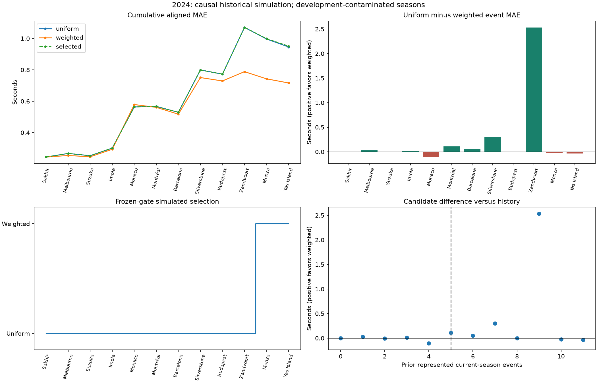
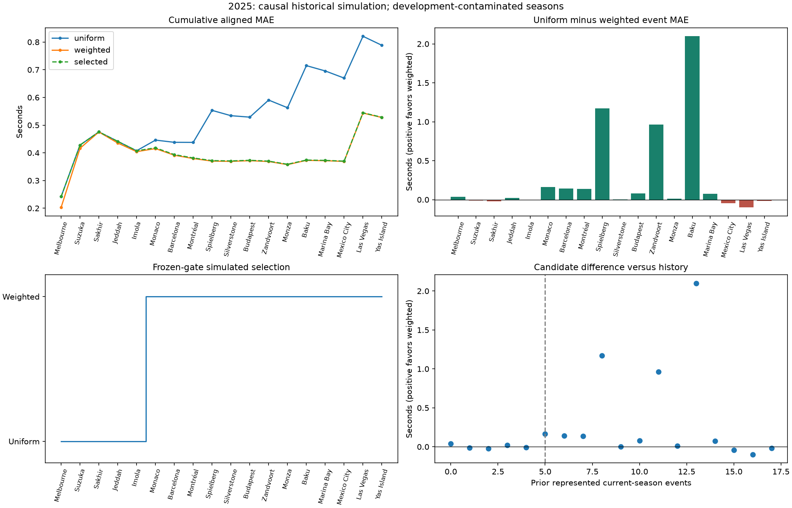

# FP3 production-policy selection: audit and Prospective Replay V2

**Decision: C — INSUFFICIENT / CONTAMINATED EVIDENCE. Retain uniform production.**

Completed 2026-09-16. This report adds evidence; it does not rewrite Milestones 21–35,
the original replay, or production records. The audit recorded before implementation is
[pre_implementation_audit.md](pre_implementation_audit.md). Every numeric table,
including all event errors, cumulative MAEs and gate states, is regenerated in
[results.md](results.md). Machine-readable values retain more precision than the tables.

## 1. Executive summary

The original replay had an evidence-retention deadlock. It fitted and predicted both
candidates, then retained only selected policy outputs as future selection evidence.
An initially unselected weighted candidate could never accumulate its required prior
folds and predictions. Its zero selections were therefore not a performance test.

A new simulation can validly consume settled prior shadow predictions. V2 does this
without altering any model, feature, weighting or gate parameter. It freshly reconstructs
legal preseason evidence, freezes predictions and selection before revealing current
outcomes, and never imports the existing shadow files. It selects weighted in 2/12
2024 events and 13/18 2025 events. This confirms the old diagnostic shadow-selection
timeline; it does not convert those historical simulations into observed live deployments.

| Season | Aligned rows / events | Always uniform MAE | Always weighted MAE | V2 selected MAE |
| --- | ---: | ---: | ---: | ---: |
| 2024 | 238 / 12 | 0.945950005 | 0.716471373 | 0.951215675 |
| 2025 | 357 / 18 | 0.788273242 | 0.527566499 | 0.528453755 |
| Pooled, row weighted | 595 / 30 | 0.851343947 | 0.603128449 | 0.697558523 |

There is a substantial historical candidate signal after cold start. But the frozen
selection policy slightly harms 2024, improvements are concentrated in a few weekends,
and **both seasons were used during candidate development**. The evidence favors testing
a conditional policy prospectively; it does not justify replacing the live default now.

## 2. Current production policy

Five separate concepts must remain distinct:

| Layer | Actual behavior |
| --- | --- |
| A. Model training | Uniform RF versus current-season-prior RF; details below |
| B. Model evaluation | Gap MAE on common target-bearing FP3 rows; walk-forward folds |
| C. Candidate eligibility | Identity, availability, current-season history, prior folds/predictions and aligned comparison |
| D. Production selection | Monitoring explicitly emits uniform as `observed_live_policy`; candidate eligibility remains diagnostic |
| E. Counterfactual evaluation | Artifact-driven policies, shadow gate audit and this new V2 simulation are separate evidence classes |

Static identity: `ablation/random_forest/base_plus_relative/uniform`. Alternative:
`ablation/random_forest/base_plus_relative/current_season_only_with_prior`.
Both use median imputation trained within the fold and sklearn RandomForestRegressor:
200 trees, depth 8, minimum leaf size 2, random_state 42, n_jobs 1. Remaining parameters
use the installed sklearn defaults. No RF scaling is applied. Versions used here:
pandas 2.3.3, scikit-learn 1.9.0, numpy 2.4.6, pyarrow 21.0.0, Python 3.13 environment.

There are **126 identically ordered features in every fit**, 42 per practice session.
The exact list is [feature_manifest.json](feature_manifest.json), with per-fit lists
and hashes in `training_manifest.csv`. They cover lap/sector times, lap counts, tyre
age/compound counts and relative session/team/teammate performance. Categorical identity,
qualifying targets, historical/quality groups, and unsupported telemetry are excluded.
This candidate does not use weather or telemetry simply because the broader project
roadmap mentions them. All-missing training columns would be omitted by existing logic;
none change the 126-column set in these runs.

Uniform gives every eligible training row weight 1.0. Weighted gives current-season rows
1.0, previous-season rows 0.35, older rows 0.10 until five represented current-season
events exist; at five it **drops every older-season row**. The retained current-season
rows all have weight 1.0. The unused exponential weighting parameter is half-life 10.
Training uses FP3 rows with a nonmissing gap target; practice-lap cleaning/push rules
are already incorporated in features. No new quality, weather or target-outlier filter
was applied in this audit.

Frozen selection requirements are FP3, matching candidate available, >=5 prior
current-season events, >=5 prior candidate folds, >=100 prior candidate predictions,
>=5 aligned folds and >=100 aligned rows, defined candidate/default MAEs, and prior
uniform MAE minus candidate MAE >=0.05 seconds. Alignment is by fold, season, event,
checkpoint and driver. The fixed comparator is the matching uniform RF. The canonical
selector is reused directly. Cold start retains uniform. The fixed 0.05 advantage rule
is not stateful entry/exit hysteresis. The FP3 guard forbids practice-baseline switching;
the two-candidate replay never introduces such a baseline.

No interval-coverage/calibration requirement gates promotion. Original replay interval
code uses the empirical 90th percentile of at least 20 prior absolute residuals. Its
`conformal_predicted_gap_bucket` label overstates the implementation: it does not use
the champion's bucket fallback or a finite-sample conformal quantile correction. V2
preserves that numerical rule and settles coverage only after outcomes are revealed.

Implementation inspected: `temporal_weighting.py`, `train_tabular.py`, `tabular.py`,
`feature_groups.py`, `champion_policy.py`, `prospective_replay.py`,
`prospective_replay_eligibility_audit.py`, `prospective_policy_evaluation.py`,
`prospective_monitoring.py`, historical/relative/target feature builders, and their tests.
Documentation inspected includes README and Handoff Milestones 15, 21–35, the comparator
and source-lineage corrections, and current monitoring governance.

## 3. Audit of previous retrospective and held-out evidence

These numbers were recalculated from prediction rows, then the original replay was
retrained from the canonical dataset. Nothing was copied into a result as a metric
substitute. See [previous_results_recomputed.csv](previous_results_recomputed.csv) and
[reproduction_parity.json](reproduction_parity.json).

| Experiment | Rows / folds | Uniform/static MAE | Compared candidate/policy MAE | Definition |
| --- | ---: | ---: | ---: | --- |
| Aligned 2023–2025 walk-forward | 774 / 39 | 0.919901257387 | 0.729089601541 | Always weighted RF |
| Artifact-driven 2023 → 2024 | 238 / 12 | 0.945950004859 | 0.951215674730 | Selected season-aware policy |
| Artifact-driven 2023–2024 → 2025 | 357 / 18 | 0.788273242231 | 0.528453754681 | Selected season-aware policy |
| Original retrain replay, 2024 | 238 / 12 | 0.945950004859 | 0.945950004859 | Selected policy, zero weighted selections |
| Original retrain replay, 2025 | 357 / 18 | 0.788273242231 | 0.788273242231 | Selected policy, zero weighted selections |
| Shadow, target season 2024 only | 238 / 12 | 0.945950004859 | 0.716471372930 | Always weighted, diagnostic |
| Shadow, target season 2025 only | 357 / 18 | 0.788273242231 | 0.527566499302 | Always weighted, diagnostic |

All candidate comparisons use identical driver/event/checkpoint rows. The retrospective
39 folds comprise 9 evaluable 2023 events after the first five training events, plus
12 in 2024 and 18 in 2025. They train on expanding prior event histories, with the
weighted window restriction described above. Current-season prior events are available.

The purported season-held-out metrics are **prospective-like policy slices of saved
walk-forward predictions**, not models trained once on 2023 or 2023–2024 and frozen for
an entire following season. They also allow chronological current-season history. The
guarded policy MAEs are 0.952566675282 and 0.549533839044, respectively. Its broader
candidate selection is not equivalent to the original replay's guarded FP3 alias for
static. These differences explain why comparing policy profiles without checking their
source identities was misleading.

Fresh original predictions match every stored prediction exactly: maximum difference
0.0 across 2,142 all-checkpoint/profile rows in the 2024 split and 3,231 in 2025.
Fresh 2025 replay shadows also reproduce both retrospective candidate artifacts exactly
on all 774 FP3 rows. The documented rounded MAEs are correct; the main corrections are
their definitions and interpretation. V2 candidate predictions match the old shadows
to floating CSV round-trip precision (<5e-16 seconds).

Shadow files include warmup: the 2024 split has 417 rows / 21 events **per candidate**
(179 preseason +238 test), with uniform MAE 1.032589989787 and weighted 0.901616573962.
The 2025 split has 774 rows /39 events per candidate (417 preseason +357 test), with
0.919901257387 and 0.729089601541. These are not test-season-only scores. Do not count
event_slug alone across seasons or pool the overlapping split warmups as independent data.
The previously quoted 0.844723/0.943403 shadow values average repeated prior-history
metrics across decision times; they are not prediction-level target-season MAEs.

All these evidence classes are retrospective development evidence or causal historical
simulations, because candidate design saw the same periods.

## 4. Audit of the original prospective replay

`prior_events_for` selects only chronological events before the target from allowed
training seasons plus earlier evaluation-season events. Both RFs are fitted anew inside
each event. Historical features are recomputed with the current event excluded as a
target source; rolling entities append outcomes only after producing that event's
features. Relative features are session-local precomputed practice comparisons and do
not require qualifying data. Neither current/future residuals nor qualifying target
columns enter fitting or the selector's prior-performance computation.

Two qualifications prevent calling the old path a perfectly sealed live simulation:

1. `fit_and_predict` receives target-bearing current rows and drops rows missing the
   current gap target. Values are not predictors, but target **availability** controls
   the evaluation population before prediction.
2. The canonical modeling table starts from qualifying target rosters. That population
   was constructed after the event; it is not an archived pre-Q entry-list snapshot.

Thus no future-event training leakage was found, but the stronger assertion that no
post-event information of any kind reaches the historical population is not established.
This audit concerns forecasting on the frozen canonical population, not a recreation of
every real-time ingestion revision, withdrawal or reserve-driver eligibility decision.

The original residual quantile uses prior selected-profile history only. Its historical
90% coverage was 85.7143% in 2024 and 87.3950% in 2025, with mean widths 3.949971 and
4.043918 seconds. No calibration result was a selection gate.

## 5. Root cause of evidence retention

For every event, `train_event_sources` fits uniform and weighted and returns their
predictions. `apply_profiles_for_event` selects uniform during cold start.
`run_true_replay` appends only those selected profile predictions to `history_predictions`.
The next `season_aware_decision` searches that history for rows whose selected temporal
policy was weighted. There are none, so candidate folds, candidate predictions and
candidate/default aligned evidence stay zero. The history gate can never bootstrap itself.

Before the shadow fix, weighted predictions existed transiently but were not persisted
as independent candidate evidence. Their post-outcome residuals could not be retrieved
by later selections. The original replay records 5 cold-start +7 insufficient-history
events in 2024 and 5+13 in 2025. After Milestone 32, the diagnostic files retain those
predictions, but the original selector still never consumes them. Its outputs are
unchanged by design. Duplicated uniform rows from multiple selected profiles cannot
create the missing candidate evidence.

Therefore the original **zero-selection outcome was structurally caused by retention**.
This does not imply that the candidate passes its margin or performs better everywhere:
V2 directly shows otherwise for several 2024 decision times and selected events.

## 6. Shadow-candidate methodology

The old shadow fix is causally valid as a **prior-only historical diagnostic**: models
fit legal histories, and the audit filters the same split to event_order strictly less
than the target before comparing aligned errors. It neither chooses using current
residuals nor changes the recorded live outputs.

It is not an immutable forecast/settlement implementation. The old helper computes
actuals and errors from target-bearing frames immediately; the report writer replaces
the split's shadow rows on rerun. It has no pre-outcome immutable snapshot transaction.
The later production monitoring implementation has a stronger targetless fitting and
forecast/settlement boundary; V2 reuses its targetless RF fit helper.

“Counterfactual” means weighted predictions were not the recorded original selections.
Retroactively rewriting those selections would misrepresent history. Starting a new
versioned simulation that consumes causally accumulated settled shadows is legitimate:
which model predicts a race does not change the observed qualifying outcome. It is
causal information-flow validation, **not an identified causal effect from randomization**.

## 7. Replay V2 methodology

The new module is evaluation-only, with no production caller and no new production
configuration. For every event it:

1. Materializes only legal prior events plus current rows with every target masked.
2. Recomputes historical features and fits both unchanged RF candidates from scratch.
3. Freezes both targetless shadows in `01_shadow.json`, with training events, actual fit
   rows, weights/features/config/data hashes and chronological step.
4. Invokes the existing canonical selector using only settled earlier shadows. Every
   gate logs observed and required values and pass/fail independently.
5. Freezes the selected forecast, prior-only interval and gate state in `02_forecast.json`.
6. Only then reads current outcomes and writes separate `03_settlement.json`, verifying
   the forecast hash. Residual availability starts at step t+1.

All immutable records allow an identical rerun but reject changed content. Creation
steps are simulation chronology, not fabricated real-world forecast timestamps.
No saved retrospective, original-replay or diagnostic shadow prediction is a V2 input.
The dataset file hash in `frozen_protocol.json` is provenance, not a model input.

Each split starts with an empty ledger. As in the original replay, earlier-season
out-of-fold history is freshly reconstructed after five initial training events. At
the first evaluation event, there are **zero current/future-season candidate outcomes**,
but legal preseason evidence: 9 folds/179 predictions in 2024 and 21/417 in 2025.
This preserves the original evidence window. A separate zero-ALL-candidate-evidence
season-start check is reported in section 15; it is not mixed into primary results.

Training cutoff records distinguish permitted historical inputs from actual weighted
fit rows. For example, at Monaco 2025, uniform fits 614 FP3 rows from 31 events, weighted
fits 98 from the five earlier 2025 events. The old manifest's generic training-row
count described the larger unfiltered multi-checkpoint input, not this actual fit.

Only 2024 and 2025 have enough history before the first represented event for a complete
season window. 2023 contributes nine legal warmup folds but cannot supply a complete
season evaluation from the beginning; no earlier data exist. There is no canonical
2026 season in the dataset. V2 predicts all canonical FP3 rows before settlement;
three 2025 rows without a valid gap are excluded only from scoring, equally for all roles.
The 2024 table already contains 238 canonical FP3 rows. No feature/weighting/eligibility
parameter or existing artifact was changed.

## 8. Leakage, lifecycle and reproducibility checks

Focused tests verify: future rows never reach the fitter; all current targets are
masked; changing current/future outcomes cannot change current forecasts or gates;
both immutable files exist before settlement; missing target rows are still forecast;
residuals start at the next event; future/unsettled evidence is rejected; candidate
history grows monotonically; both candidates share unique target keys; reruns are
identical; altered snapshots are rejected; original replay still reproduces zero
selection; and a diagnostic directory cannot redirect production's live uniform role.
Whole-event bootstrap determinism and event-vs-row estimands are tested too.

Full suite: **663 passing tests**, including 10 new focused tests. No old test was
weakened. Lint/format and diff checks passed. A complete second canonical V2 run verified
**186 byte-identical primary files**, including all event snapshots and CSV ledgers.
Hashes verified **326 existing metric, dashboard, model, dataset and configuration files
unchanged**. See `determinism_verification.json` and `protected_artifacts_verification.json`.
Warnings concern sandbox CPU/font-cache access and pandas future concatenation behavior;
they do not indicate failed fits or tests. The final validation record is `validation.json`.

## 9. 2024 results

Twelve represented FP3 weekends, 238 aligned rows; five cold-start events. Non-margin
history gates first pass at Montréal after five current-season events. The 0.05 prior
advantage gate fails through Zandvoort: prior gain there is only 0.021606 seconds.
Zandvoort's large subsequently revealed improvement lifts the prior gain to 0.148194
at Monza. Selection switches once, to weighted at Monza (10 prior current-season events),
and remains weighted at Abu Dhabi/Yas Island (11 prior events).

Uniform: 10/12 events (83.33%); weighted: 2/12 (16.67%). Those two selected events both
slightly favor uniform in realization. Before first selection, MAEs are uniform 1.070717,
weighted 0.788550, selected 1.070717 over 198 rows/10 events. After first selection they
are 0.328354, 0.359684 and 0.359684 over 40 rows/2 events. This is delayed evidence
accumulation, not current-event outcome selection. It explains why the candidate's
strong full-season average does not translate to policy improvement that year.



## 10. 2025 results

Eighteen represented FP3 weekends, 357 aligned rows; five cold-start events. Preseason
shadow evidence already passes the history and margin gates, but current-season history
blocks the first five events. First full eligibility is Monaco after five represented
2025 events, with 26 prior candidate folds/515 aligned predictions and prior gain 0.106665.

Uniform: 5/18 (27.78%); weighted: 13/18 (72.22%). Selected weighted events are Monaco,
Spain/Barcelona, Canada/Montréal, Austria/Spielberg, Britain/Silverstone, Hungary/Budapest,
Netherlands/Zandvoort, Italy/Monza, Azerbaijan/Baku, Singapore/Marina Bay, Mexico City,
Las Vegas and Abu Dhabi/Yas Island. There is one switch, no switch back.

Before selection: uniform 0.407476, weighted 0.404244, selected 0.407476 over 98 rows/five
events. Afterwards: uniform 0.932359, weighted/selected 0.574229 over 259 rows/13 events.
The weighted choice is still worse at Mexico City, Las Vegas and Abu Dhabi.



## 11. Aligned uniform-versus-weighted comparison

Every `d_i` is `abs_error_uniform_i - abs_error_weighted_i` on the exact same row.
Positive means weighted wins. No candidate-specific missing-row denominator is used.

| Season | Row mean d | Row median d | Rows improved | Rows worse | Ties |
| --- | ---: | ---: | ---: | ---: | ---: |
| 2024 | 0.229479 | 0.000375 | 50.00% | 41.60% | 8.40% |
| 2025 | 0.260707 | 0.033135 | 56.30% | 43.70% | 0.00% |
| Pooled | 0.248215 | 0.016122 | 53.78% | 42.86% | 3.36% |

Pooled d has 5th/25th/75th/95th percentiles -0.348716, -0.073611, 0.157444, 2.259982;
minimum -1.700123, maximum 5.816736 seconds. Gains are right-skewed and do not mean most
individual drivers improve by the aggregate mean. Complete distributions and all 595
rows are in `paired_uncertainty.json` and `aligned_predictions_errors.csv`.

## 12. Gate-by-gate timeline

[results.md](results.md) prints every event and every gate. The full machine-readable
timeline is `per_event_gate_states.csv`, including candidate/default prior MAEs, folds,
predictions, exact aligned count, dropped rows, observed/required gate values and reasons.
`selected_policy_by_event.csv` records both switch points.

Candidate availability, identity/checkpoint, legal-history and alignment counts pass
throughout evaluation once legal preseason evidence is reconstructed. In 2024 the
margin independently fails for the first 10 events; the current-season gate also fails
for the first five. In 2025 only current-season history blocks the first five. Existing
production policy remains uniform regardless of this simulation's eligibility.

## 13. Cold-start versus established-season analysis

Regimes use the already-defined counts: cold <5, early 5–8, established >=9 represented
prior current-season events. They are not calendar rounds, and omitted weekends do not
count as available history.

| Season / regime | Events / rows | Uniform MAE | Weighted MAE | Selected MAE |
| --- | ---: | ---: | ---: | ---: |
| 2024 cold | 5 / 99 | 0.563623 | 0.578834 | 0.563623 |
| 2024 after cold | 7 / 139 | 1.218255 | 0.814501 | 1.227271 |
| 2025 cold | 5 / 98 | 0.407476 | 0.404244 | 0.407476 |
| 2025 after cold | 13 / 259 | 0.932359 | 0.574229 | 0.574229 |

Weighted improves 5/7 post-cold weekends in 2024 and 10/13 in 2025. But the established
subset alone improves only 1/3 in 2024 (dominated by Zandvoort) and 6/9 in 2025. Those
established-subset event bootstrap intervals include zero. The broader post-cold
event-mean intervals are [0.004981, 1.144770] and [0.058443, 0.736621] respectively.
These are exploratory subset diagnostics with no multiplicity correction.

There is evidence of **regime dependence**, not a demonstrated monotonic relationship
between history length and advantage. The training policy itself changes at five
events, so these plots cannot identify five as an optimal causal threshold independently
of the candidate's design. Option D is a sensible future prospective hypothesis; it
is not currently a validated production replacement.

## 14. Event-level uncertainty and concentration

Each weekend is first averaged equally. Mean d: 0.238234 in 2024, 0.261295 in 2025.
Medians: 0.005583 and 0.030652. Weighted improves 7/12 weekends in 2024 (four worse,
one tie), and 12/18 in 2025 (six worse). Pooled: 19/30 improve, event median 0.016611.

Paired whole-event bootstrap, 10,000 replicates, seed 2026022; pooled resampling is
stratified by season. Both candidate rows stay together within a sampled event.

| Estimand | 2024 95% interval | 2025 95% interval | Pooled 95% interval |
| --- | --- | --- | --- |
| Equal-event mean uniform minus weighted | [-0.010003, 0.681717] | [0.037718, 0.552540] | [0.060435, 0.495914] |
| Row-weighted MAE difference, event clusters | [-0.010156, 0.660887] | [0.037775, 0.553761] | [0.059308, 0.487392] |

Selected-policy event improvement vs uniform has interval [-0.012662, 0] in 2024 and
[0.036047, 0.550397] in 2025. These are diagnostic intervals: 12/18 events are small
samples, adjacent events share training histories, event exchangeability is imperfect,
and all data were used in development. They are not post-selection formal proof.

Removing any one event leaves the always-weighted event mean positive: minimum
0.029584 in 2024, 0.153272 in 2025. Nevertheless, Zandvoort 2024, Baku 2025 and Austria
2025 contribute 76.84% of the pooled net row-error reduction in the two evaluation
seasons. This differs from the older 73.1% concentration figure because that report
also includes 2023 and uses its own aggregation scope. Full-season benefit is persistent
under single-event removal but concentrated and much less typical than its mean suggests.

## 15. SENSITIVITY ANALYSIS — after the frozen replay

The predeclared 81-setting Cartesian neighborhood varies only selection governance:
current-season events {4,5,6}, prior folds {4,5,6}, predictions {80,100,120}, margin
{0.025,0.05,0.075}. The RF, feature set, weighting parameters, five-event **training**
window transition, calibration and evidence history remain fixed. All settings are
reported, with none chosen for deployment.

* 2024: all 81 select exactly Monza and Abu Dhabi; selected MAE remains 0.951216.
* 2025: all 81 select weighted for 12–14 events; selected MAE ranges 0.528454–0.537668.
  The range is entry at Imola, Monaco or Barcelona under 4/5/6 current-season events.
* Every setting switches once. Fold and prediction-count neighbors are nonbinding here
  because sufficient legal preseason evidence exists. This does not establish that those
  thresholds are ideal when evidence is sparse.

Additional zero-margin churn diagnostic (not a proposed setting): 2024 selects six
events from Barcelona, MAE 0.719344; 2025 is unchanged. Both still switch only once.
Thus the existing 0.05 margin delays 2024 entry, but this sample does **not** demonstrate
that it prevents noisy model churn. Its near-threshold neighborhood is stable; the
zero-margin result is not permission to tune the rule retrospectively.

Initialization sensitivity: if ALL candidate evidence is reset at the start of each
evaluation season, while training retains its legal prior seasons, 2024 still selects
two events (MAE 0.951216). 2025 starts at Austria after eight represented prior events,
selects ten events, MAE **0.553356**. At Monaco, only 98 same-season settled rows exist,
so the 100-row gate blocks; the next two events pass row counts but fail the 0.05 margin.
This scope difference explains why “zero future evidence” must not be confused with
“discard all legal preseason evidence.” Full reset decisions are in
`season_reset_sensitivity.csv`; they do not replace the primary protocol.

A more principled future rule could preregister a practically meaningful event-level
advantage and uncertainty/robustness requirements, specify treatment of the training
regime transition and use separate entry/exit conditions if churn is a concern. Any
new constants must be set before collecting fresh evidence and assessed as a new policy.
No such rule was implemented or tuned here.

## 16. Experimental contamination

| Design element | Evidence from repository | What can be concluded |
| --- | --- | --- |
| Features and RF defaults | Earlier modeling/ablation milestones used historical events; RF configuration introduced in commit 5197ef4, 2026-06-14 | No untouched validation claim for periods used in development; exact hyperparameter search is not documented |
| Weighting family and candidate choice | Milestone 21 compared four temporal policies on 2023–2024; Milestone 22 extended to 2025; Milestone 23 explicitly chose the best Milestone 22 candidate | Both 2024 and 2025 were exposed to candidate development/selection |
| Weight constants and five-event training/cold-start rules | Present in the development milestones and commit ec8fecf, 2026-06-24 | No independent preregistration/search ledger establishes these constants as untouched by observed periods |
| Five folds, 100 predictions, 0.05 margin | Stabilization Milestone 15 and commit 4b9e0ec, 2026-06-23; reused in season-aware governance | Frozen within this experiment, not proved independently justified by untouched data |
| Alignment and further governance audits | Milestones 24–34 repeatedly inspect the same seasons and source artifacts | Methodological repair improves validity but does not erase development reuse |

Do not claim that each numeric constant was optimized: the available history does not
prove that. Do state that there is no clean development/validation separation for the
final candidate and governance package.

Evidence taxonomy: (1) retrospective development comparisons; (2) causal historical
V2 simulation conditional on canonical populations; (3) untouched prospective evidence.
Category (3) is absent from the canonical historical windows. Existing monitoring
documentation also quarantines legacy/synthetic records from real prospective evidence.
Neither retagging artifacts nor rerunning chronologically can manufacture an untouched
season after seeing its results.

The current local monitoring files deserve a separate qualification: the old readiness
JSON says no evidence, while the later July 28 summary says six settled events. Inspection
of actual registry/settlement rows finds three synthetic events, legacy Australia and
Great Britain, and Hungarian GP 2026; Belgium has forecasts without targets. Therefore
the six-event aggregate must not be treated as six clean prospective weekends. Hungary
has 21 aligned scored drivers, stored valid settlement/forecast-fingerprint flags and
zero current-season prior events; its shadow manifests report the 44 canonical 2023–2025
training events. Recomputed uniform MAE is 0.523410 and weighted MAE
0.581863. This is one cold-start monitoring record, not a complete untouched season or
post-cold-start validation. This audit inventories it separately, without independently
recertifying wall-clock pre-Q timing/raw identity or adding it to canonical V2 results.
See `supplemental_monitoring_inventory.csv`. The appropriate statement is **no untouched
full prospective season is available**, not that the repository contains no later
monitoring records at all.

## 17. Final production-policy recommendation

**Retain uniform in production, under outcome C.** Outcome B would understate the strong
historical weighted signal; outcome A would overstate independence and cross-season
policy consistency. Outcome D merits a preregistered prospective test: uniform during
cold start, weighted only after legally accumulated evidence and frozen gates. It is
not yet justified as a production change, and “always weighted” is particularly poorly
supported during cold start.

Needed before a real change: immutable before-Q predictions from both candidates on
new real events not used for design; strict roster/raw-session/settlement identity
validation; coverage of cold, early and established regimes across multiple circuits;
predeclared aligned event-level evaluation and practical margin; event-concentration,
tail-risk and interval checks; a separately reviewed versioned production-selection
proposal. Ideally collect a complete untouched season, with more than one season useful
for assessing between-season stability. Do not stop collection at the first favorable
aggregate or alter thresholds after inspecting it.

No promotion/deployment was attempted. If a future review approves a conditional
policy, production work would explicitly change `prospective_monitoring.py`'s uniform
live-row selection and associated protocol/config fingerprint contracts, not just load
this diagnostic directory. Required tests would cover both live branches, settlement,
driver eligibility, source identity, chronology, immutable reuse, dashboards and rollback.
Rollback would restore the versioned uniform live policy/protocol for future forecasts;
already frozen predictions and settlements must remain immutable. That change is a
separate reviewed task, not an implicit consequence of these metrics.

## 18. Limitations

Only 30 target-season weekends, and the 2024 sample has just 12. Sprint/nonstandard and
other missing weekends limit generalization. Counts refer to represented prior events,
not all real races. Historical practice data may have later corrections. The canonical
roster is post-event-derived, so V2 is target-value-blind conditional evaluation rather
than a complete archived live-data reconstruction. No raw data were redownloaded.

The target builder uses each driver's best valid lap across qualifying and subtracts
the session minimum. Its position/Q2/Q3 fields are derived proxies, not a guaranteed
official phase classification. We evaluate only the existing gap target and do not
change it. Weather/phase evolution may contribute to heavy tails. This audit does not
attribute gains causally to a physical change in car performance or prove that five
events is the uniquely correct window. Calibration labels and small-sample uncertainty
limitations are described above. Prospective predictions would need unchanged, verified
environment/data contracts to reproduce these numerical models exactly.

## 19. Reproduction and files

Run from the repository root with the existing `.venv` and local canonical dataset:

```bash
# Rebuild original replay in an isolated output directory and recompute older metrics.
.venv/bin/python -m f1_prediction.modeling.prospective_replay_v2_analysis --reproduce-original

# Refit both candidates event-by-event in every complete historical season window.
.venv/bin/python -m f1_prediction.modeling.prospective_replay_v2 --analyze

# Run the same command again: all event records must be byte-identical or it fails.
.venv/bin/python -m f1_prediction.modeling.prospective_replay_v2 --analyze

# Analysis alone (includes all fixed-neighborhood sensitivity settings and plots).
.venv/bin/python -m f1_prediction.modeling.prospective_replay_v2_analysis

# Recheck previous stored artifacts against the fresh isolated original replay.
.venv/bin/python -m f1_prediction.modeling.prospective_replay_v2_analysis --verify-previous

.venv/bin/python -m pytest
.venv/bin/ruff check src/f1_prediction/modeling/prospective_replay_v2.py src/f1_prediction/modeling/prospective_replay_v2_analysis.py tests/test_prospective_replay_v2.py
.venv/bin/ruff format --check src/f1_prediction/modeling/prospective_replay_v2.py src/f1_prediction/modeling/prospective_replay_v2_analysis.py tests/test_prospective_replay_v2.py
git diff --check
```

No network, paid service or production artifact write is required. The default artifact
directory is `reports/prospective_replay_v2`; `--output-dir` permits an independent new
directory. A changed dataset/config must use a new directory/version, since immutable
records refuse replacement. Large forecast/settlement/fitting ledgers, original replay
Parquets and per-event JSON snapshots are local generated outputs ignored by the local
`.gitignore`. Compact aligned rows, metrics, gates, manifests of features, sensitivity,
checks and reports remain available for review. The dataset SHA-256 is
`dca8fb564d953f699a37405ccbef75eb2b77ea4282ed4dc81b14d802a01a2165`.

New source: `prospective_replay_v2.py` enforces chronology, frozen selection and separate
settlement; `prospective_replay_v2_analysis.py` reproduces older results and generates
aligned analyses/reports; `tests/test_prospective_replay_v2.py` adds the focused tests.
`PROJECT_HANDOFF.md` receives an append-only audit entry. README is not edited by this
task because the production-policy conclusion remains unchanged; its pre-existing user
changes are preserved. No original replay/monitoring implementation or model config is
modified, and nothing is committed or deployed automatically.
